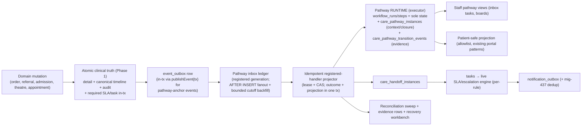

# Unified Care Pathways — Program Design (v3)

Status: **Standalone normative design baseline for owner review; independent quick-win status is tracked in §11.**

Provenance and review history:
- v1: GPT‑5.6‑Sol chat draft "VH Health Unified Care Pathways Plan" (read-only at `1e9618f52`).
- v2: Fable 5 repo-grounded cross-review, verified at `de19f8b75`, merged `f06553eba` (PR #586).
- v3 (this document): incorporates the GPT‑5.6‑Sol round-2 re-review, whose load-bearing
  findings were independently re-verified by Fable 5 against `github/main`
  **`0ee456f1e85105149beb15d330e338be369afa94`** (2026‑07‑17). Every code claim carries a
  `path:line` anchor; **line numbers were derived at the SHAs above and drift — re-derive before
  citing in build prompts.**

This document is the **self-contained implementation baseline**: it no longer defers any normative
content to an unavailable chat draft. Full pathway flows, branches, closure rules, product work,
metrics, the origin→child matrix and the acceptance matrix are inlined below (§5–§8, §12).

S1b-b synchronization note (2026-07-19): the frozen migration identities are 580
`A41495FC511BD5238FE548E9185A1461715B47AA54607C7F42FF8AD79EDAA979`, 581
`43AFB83D57E50E738540ADDCC02875C35826884B3D9D4D7B31BBAEBB77B61CB4`, 582
`F0CEA6E6EA63F9CF5932ACBD99EE9508A2E838D3715D09B969AED99E3A0E41F0`, and 583
`7D1ABE4238FA95D4BAFBEA9E86052DF8C53CA8361FEFDCF407EA9E44E10919F1`, and 584
`F799232A9007CB3A69DEA11D7131C96913578E94BB8C62B9C1B6106921C31EB7` (73,446 bytes). Migration 584
adds typed terminal governance retirement, immutable runtime/replay pins, and retryable fail-fast
serialization for lock-inversion surfaces. The cutover tail is 580–584, not 580–583. Final focused
evidence on the frozen bytes is: independent P0/P1/P2 review, 0/0/0; a fresh PostgreSQL 17 build through
all 568 migrations; full schema-plus-transition conformance, 114/114; focused former-deadlock cases, 2/2
returning `40001` and never `40P01`; runtime deep, 7 suites/72 tests; units, 5 suites/136 tests; and clean
schema-drift, Prisma, raw-parameter, ESLint, and diff checks. This is not a whole-program or full-CI claim.

Final S1b-b full-CI exit evidence (2026-07-20), additive to the focused evidence above: a fresh blank PostgreSQL 18.4 database applied all 568 migrations; unseeded and seeded database contracts each passed 13/13; exhaustive seed coverage left 812/812 application tables non-empty. Two consecutive runs of each readiness audit exited 0 with zero blockers; the care-spine report was ready, while both combined lab/pathway reports explicitly retained `care_pathway_production_activation_ready=false`, as required until S1b-c. The final backend gate passed lint, raw-parameter/PHI/tenant/region/secret checks, dependency audit, Prisma generation and schema drift, OpenAPI drift/core sync, Spectral with zero errors, Docker-backed database guardrails, and all 1,152 Jest files in 144/144 chunks; it exited 0 in 4,698.3 seconds. This blank-database rehearsal is clean-install/full-CI evidence only, not a production-clone rehearsal or production-activation evidence.

Owner-decision synchronization (2026-07-21): D3–D7 and D10 are approved in §9. Pending results no longer
hard-block discharge when the signed summary and named primary-physician ownership are established;
normal results may auto-close with an audited discretionary re-review path; abnormal non-critical results
require doctor review and countersignature; referral responsibility transfers only when the named
receiving doctor explicitly accepts; surgical `sign_in` is mandatory; and a named clinician is an
exclusive, active, route-capable owner rather than a role-queue hint. These are inputs to S1b-c and S2–S5,
not claims that S1b-b already implements or activates them. D10's exclusive-routing prerequisite is the
bounded S1b-c1 sub-slice. S1b-c2 adds explicit current-role queue claim and accepted covering-clinician
reassignment without creating or activating a pathway definition; pathway-specific owner-source
resolution remains S2–S4 work. Numeric timings and the standing policy list remain unsigned.

Round-2 verdict on v2: **APPROVE WITH CHANGES.** The architecture and vertical delivery strategy hold;
the round-2 review found four correctness defects (a cursor that can lose events, an under-specified
runtime, an over-broad task/SLA contract, and a materially wrong Stroke prior-art claim) plus missing
normative content. All are folded in and were re-verified — see §0.

The OBGyn merge train that constrained v2 is **complete** (lanes merged through #585/#595/#596/#598/#599
and later). The v2 file-exclusion lanes are historical; §4.2 replaces them with a convergence contract.

---

## 0. Round-2 corrections (re-verified at `0ee456f1e`)

| # | v2 said | Re-verified finding | Resolution in v3 |
|---|---|---|---|
| C1 (P0) | Wave‑1 cursor = `event_consumer_offsets` scalar high-water over `event_outbox.id` (§3.3) | **A scalar live `id` watermark loses events.** `event_outbox.id` is `BIGSERIAL` (mig 009); a sequence value is allocated at INSERT, before commit, so commit order ≠ id order. A poller doing `WHERE id > :hw ORDER BY id` can advance past a higher id that committed first, then never see a lower id that committed later. Confirmed by construction. | **§3.3 rewritten** to one live-intake generation per consumer, commit-coupled `AFTER INSERT` fanout, and persistent bounded keyset backfill through a fixed cutoff. A scalar live high-water remains rejected; replay is a lock-fenced handoff to a fresh higher generation. |
| C2 (P0) | "runtime build list" (v2 §3.4) implied but did not specify the executor; `care_pathway_instances` "1:1 workflow_runs" left state ownership ambiguous | Correct: v2 named no executor and two candidate state homes. | **§3.4a** specifies one deterministic registered-handler executor; **§3.5** declares `workflow_runs`/`workflow_steps` the *sole* mutable execution state and `care_pathway_instances` a 1:1 context/closure companion. |
| C3 (P0) | "task-first rule: every human-actionable stage materializes a `tasks` row" + "generic breach sweep for orphaned SLA instances" | Too broad. Patient/guardian/external/automated-wait stages must not become synthetic staff tasks; a **table-wide** breach sweep would collide with domain-owned clocks (porter marks its own SLA breached — `porterTransportService.js:~1423-1547`; stroke/STEMI own theirs). The review also found an acknowledgement authz hole: `POST /clinical-inbox/tasks/:id/acknowledge` could stop another clinician's escalation clock. | **§3.4b/§3.7** scope task-first to internal accountable work, make breach reconciliation **opt-in per registered rule** (domain clocks excluded), and require every task to declare its SLA-completion semantics. The live acknowledgement hole is now closed as quick-win #2 (§11); spine conformance must preserve that boundary. |
| C4 (P0) | "Stroke(506)/STEMI(559) … append-only, sequence-numbered, SLA/canonical FKs → copy their shape" | **Materially wrong for Stroke.** Verified: STEMI `stemi_pathway_events` (mig 559) has `sequence_number` (unique per activation), FK to `workflow_sla_instances`, FK to `clinical_audit_events`, append-only ("in-place mutation is blocked"). Stroke `stroke_pathway_events` (mig 506, full file read) has **no** sequence, **no** SLA FK, **no** audit FK, **no** append-only trigger, and carries `updated_at` — it is mutable. | **§3.6/§4.1 corrected:** copy the **STEMI** ledger shape specifically; the coexistence boundary is **domain-clock ownership**, not "intra- vs cross-encounter"; Stroke is documented as a weaker mutable table (its own hardening is a separate, owner-gated decision). |
| C5 (P0) | Diagnostics pilot = extend the lab critical loop | Correct at review time, but "end-to-end closed loop" was overstated: lab critical detection/tasking was post-commit best-effort; task-inbox ack and `lab_critical_alerts` ack were two state machines; and the #587 reopen helper superseded whenever called. | **S1b-b** makes supported lab ingestion/sign-off and its exact alert/task/SLA/canonical generation atomic and supplies one authoritative acknowledgement. **§5.1** still gates activation on clean migration/readiness evidence, governed critical↔normal semantics, radiology/AP structured criticality, and resolution of orderless external-source linkage. |
| C6 (P0) | v2 said pathway flows/branches/closure/metrics/matrices were "adopted from Sol §5" / "per Sol" | Correct defect: those references point at a chat-only draft not in the repo. | **§5–§8, §12** inline the full corrected normative content; this document stands alone. |

Re-verified factual corrections (were imprecise or stale in v2 / the working memory):
- `event_outbox` rows are **retained** (`delivered`/`failed`), not deleted — say "status-mutates rows for the webhook pipeline," not "destructively consumes."
- At the round-2 grounding revision, no independent **`event_outbox`** consumer cursor existed (the SIEM
  export has unrelated cursor prior art). S1a now adds `event_consumer_offsets` specifically as explicit
  generation registration + fixed-cutoff historical progress; it is not a scalar live completeness cursor.
- The `(status, available_at, id)` index does **not** provide a bare `WHERE id > X ORDER BY id` scan — the **primary-key** index does (`id` is non-leading in the composite).
- Stroke/STEMI/cath pathways are **route-mounted and tenant-gated (default disabled)**, not "clinically live."
- "Zero definitions ever created" → "no in-repo seed or programmed producer of `workflow_definitions`; a deployed-DB row count requires preflight" (a repo grep can't prove an operator never hand-created one).
- The `taskService.js:1083` "engine left to a follow-up" comment concerns the **escalation/SLA/automation‑rule** CRUD section, **not** the workflow-run executor. The no-executor claim for `workflow_runs`/`workflow_steps` still holds (the service only has `startWorkflowRun` + blind `transitionWorkflowRun/Step`, no advance/dispatch), but the correct anchor is that absence, not `:1083`.
- **mig 352 exists and changes the #587 RLS lore:** `352_workflow_sla_rules_global_policy.sql` rewrote the `workflow_sla_rules` `tenant_isolation` policy so global (`tenant_id IS NULL`) rules are **visible under a set tenant GUC** (they were hidden by the mig‑304 generic policy, silently skipping canonical SLA starts inside `setTenantTx`). Future reopen/SLA work must **not** copy the pre‑352 plain-singleton bypass the #587 helper used; that rationale is now obsolete.
- S1a reserves migration **578** (`578_pathway_projector_inbox.sql`); the next-free number is **579 at this revision**. The two files sharing `574` remain — always re-derive the next number at build time from `ls apps/backend/src/migrations | sort -V` and never reuse the colliding prefix.

---

## 1. Executive decision (unchanged core)

Do **not** build six independent pathway engines, and do not buy/port an external workflow engine.
Build **one Pathway Spine**: a coordination layer over the existing clinical sources of truth.

The spine **never**: invents diagnoses, auto-approves clinical decisions, advances a stage on AI
output, silently closes unresolved work, or becomes a second clinical record. Feature tables
(appointments, admissions, emergency_visits, referrals, investigations, ot_schedules, …) remain the
clinical source of truth; the canonical timeline/audit invariant (`CLAUDE.md`, "Canonical clinical
timeline invariant"; `docs/CANONICAL_CLINICAL_TIMELINE.md`) remains binding and is the spine's anchor
stream, not something it replaces.

This mirrors the HL7 FHIR separation of reusable definition, applied plan and executable work
([PlanDefinition](https://hl7.org/fhir/plandefinition.html) /
[CarePlan](https://hl7.org/fhir/R5/careplan.html) / [Task](https://hl7.org/fhir/task.html)) without
converting VH Health's internal model wholesale to FHIR.

Two reliability classes, named by the platform's existing convention (`apps/backend/CLAUDE.md`,
"Phase 0/1/1.5/2 transaction boundary rule"):

1. **Safety-critical records** — detail row + canonical timeline + audit + required SLA/task —
   persist atomically with the originating mutation (Phase 1, in-tx). This is already how lab
   sign-off, handover, discharge-sign and referral transitions behave.
2. **Coordination projections** — pathway instance state, dashboards, notifications — are post-commit
   (consumer), durable, idempotent, replayable, and visible in a recovery queue. A projector outage
   must never erase or contradict clinical truth, and **no required safety task may depend solely on
   the projector running** (see §5.1 C5).

---

## 2. Verified repository position

### 2.1 Spine substrate today

| Asset | State | Evidence |
|---|---|---|
| `workflow_definitions/runs/steps` (mig 118) | Dormant CRUD scaffolding; JSONB steps; **no executor**; non-atomic start; blind transitions; no history; no duplicate-run guard | `taskService.js:745-814` (run INSERT then per-step INSERT loop, malformed steps silently skipped `:791`, dup swallowed `:806`); blind UPDATEs `:847-878`, `:901-939`; admin-only CRUD `tasksWorkflowRoutes.js:182-278` |
| `tasks` + `task_comments` | **Live.** Transition map exists (`:47`, checked `:389-401`) but generic transition read-then-write TOCTOU remains (`:422`). `acknowledgeTask` now authorizes assignee/assigned-role/admin or an exact active break-glass record, revalidates authority in its CAS, masks task-existence denials, and carries transactional SLA/comment writes for trusted workflows (quick-win #2); one-open-task-per-resource dedup (mig 312) | producers: `resultsInboxService.js`, `deathCertificationService.js`, `coldChainService.js`, cath/NPS/teleconsult |
| `approvals` | Live in credential-privilege approval with a transactional lock (`credentialingService.js:~330-446`); shared table also used by the workflow CRUD | as cited |
| `escalation_rules` + engine | **Live**, seeded (mig 312); cron `*/2` (`scheduler.js:~706`); evaluates **`scope='task'` only**; orphan backfill covers **`critical_result_ack` only** (`escalationEngineService.js:~401-604`); fires via `notificationOutbox` | as cited |
| `sla_definitions` (mig 118) + `automation_rules` (mig 118) | Dormant, zero consumers | grep-verified |
| `workflow_sla_instances` (mig **269**) + `workflow_sla_rules` | **Live, polymorphic** (`source_table`+`rule_code`): referrals (`referralService.js:445`), stroke/STEMI/porter/cold-chain; pending clocks limited to 3 STEMI rules (mig 562); global rules visible under tenant GUC after **mig 352** | as cited |
| Tenancy | All nine mig-118 tables carry `tenant_id`; RLS retrofitted in mig 304 (gap between 118 and 304); `workflow_sla_rules` policy fixed in mig 352 | mig 304, mig 352 |
| Event outbox | Status-mutating webhook feeder; statuses pending/processing/delivered/failed; MAX_ATTEMPTS 7; dead-letter has **no requeue endpoint** (`eventOutboxRoutes.js` = list/mark only); id is `BIGSERIAL` | mig 009; `eventOutboxService.js:13-16,125,161-259` |
| `publishEvent` | Dual-mode: `tx` param → in-tx atomic, re-thrown; no tx → post-commit swallowed. ~200 event types from ~40 producers; **appointments and billing emit nothing to the outbox** | `eventOutboxService.js:56-120` |
| Notification outbox | UPPERCASE statuses, retry<3, 2-min drain; recipient_id `::text` (mig-C3 / PR #576 merged) | `notificationOutbox.js:4-46` |
| Engagement dedup ledger (mig 437) | `UNIQUE(tenant_id, idempotency_key)` + suppression events; wired into `engagementCampaignService.js:~848-872` | mig 437 |
| Flag/shadow precedents | `careTeamEnforcement.js` and `ledgerAuthoritativeMode.js` — both `off/shadow/enforce` from `tenants.settings` (mig **013**, not 351) via `tenantSettingsService.js` | as cited |
| Reconciliation precedent | `reconcileLedger` per-tenant sweep + `reconciliation_checks` rows (mig 349) + `ledger-reconciliation-evidence.mjs` clean-streak **flip gate** | `ledgerReconciliation.js:~93-192` |
| Scheduler | ~55 crons, all `withJobLock` (in-process set + `pg_try_advisory_lock` on a dedicated client) | `scheduler.js:~83-178` |
| Patient projection precedents | `PATIENT_VISIBLE_NOTE_TYPES` allowlist + filter clamp (`patientPortalService.js:~1144-1154`); `PATIENT_VISIBLE_DISCHARGE_STATUSES=['signed','delivered']`; result release policy (mig 294); What's Next = `carePlanService.getPatientWhatsNext` behind `GET /care-plans/whats-next` | as cited |

### 2.2 Loops that already close (build on, do not rebuild)

- **Lab critical results:** verified critical → `tasks` row assigned to the ordering clinician with
  DUTY-role fallback + `critical_result_ack` SLA → 2‑min T1/T2/T3 escalation → clinician ack endpoint.
  S1b-b commits supported manual/panel/ORU/ASTM ingestion and corrected/amended sign-off with the exact
  alert/task/SLA/canonical obligation in one transaction, and both lab-alert and inbox routes use one
  authoritative acknowledgement transition. Orderless external-source linkage remains an activation blocker.
- **Patient result release:** sign-off gate + `release_hold=false` + explicit release or 24 h
  auto-release (mig 294; `portalAccessService.js`); doctor hold needs a reason; preliminaries suppressed.
- **Discharge readiness:** typed blockers incl. `PENDING_RESULTS`, `PENDING_RADIOLOGY`,
  `DISCHARGE_CONSULTS_PENDING`, `UNPAID_INVOICE`, `FOLLOWUP_NOT_BOOKED` (`admissionService.js:~2419-2637`;
  the pending-results probe is patient/time-window scoped and can fail open — verify before relying on it
  as a safety gate); Discharge Hub aggregates them; 7-day readmission auto-link.
- **Referral canonical + first-response SLA:** every transition emits canonical events in-tx (atomicity
  test exists); `referral_response` SLA runs request→first-seen/accept (`referralService.js`).
- **ED:** full visit state machine with LWBS/against-advice as statuses **and** dispositions
  (`edOperationsService.js`); trauma workbench (migs 519-521) adds team-role accept/arrive acks + MLC gates.
  *Note: ED does not enforce terminal status↔disposition pairing.*
- **Theatre:** hard closure gates — consent, time_out, sign_out, finalized+signed anaesthesia and intraop
  notes, all instrument counts, booked-surgeon signoff (`theatreService.js`). *`sign_in` is recordable but
  not gated.*
- **Offline clinical writes:** queued writes replay with client timestamps + stable idempotency keys
  (vhhealth_core `OfflineQueue`/`ConnectivitySyncService`); MAR/CPOE/e‑Rx wired.

### 2.3 Verified continuity gaps (the program's actual work) — see §5 for the full per-pathway flows.

| Pathway | Where the loop stops today |
|---|---|
| Diagnostics | Non-critical results end at sign-off→release→order `COMPLETED`; **no orderer-disposition concept exists**. Radiology/AP stop at sign-off (only a TAT-breach alert). Amendments re-enter nothing (corrected lab sign-off skips re-notify/re-task/critical re-detect; radiology/AP addenda append-only, no re-ack — **lab half fixed in PR #587**, radiology/AP open). Specimen reject/recollect exists at investigation level; `lab_specimens` has no rejected state. No pending-at-discharge results-ownership concept (block-only). |
| Referral | Specialist `completed` is terminal; **no originator acknowledgement anywhere**; response unstructured/unsigned; **nothing fires on SLA breach** (no task, no `escalation_rules` row); no re-route/expiry/appointment-link/duplicate guard; UI shows `in_progress/cancelled/expired` the backend never writes; **no patient referral surface**. |
| OP | `COMPLETED` is terminal; no per-visit tracking that ordered tests/referrals/prescriptions completed; `follow_up_plans` written only manually; no-show handling = reaper flips stale `SCHEDULED→MISSED`, no recovery; appointments emit no outbox events. |
| Inpatient | Gate-blocked discharge is strong, but blockers lack named owners; no post-discharge contact concept (a *booked* follow-up ≠ outreach); no discharge-with-named-results-owner alternative to the hard block. |
| Emergency | ED→ward is push-with-no-accept (creating the admission closes the ER chart); no destination-acceptance ack; no aftercare/callback (the `follow_up_plans.origin_kind='er_visit'` seam is unwritten). |
| Surgery | `completed` is terminal; specimens are free JSON on intraop notes with **no pathology accession**; post-op follow-up is free JSON (`origin_kind='ot_case'` never written); `sign_in` recordable but not gated; no distinct pre-op clearance entity. |

Journey-test stopping points (extend these, don't only add new files): walk-in-opd (timeline after
COMPLETED), inpatient-admission (**never reaches discharge**), emergency-walk-in (disposition),
surgical-day-care (discharge, with follow-up/consults test-seeded), lab-walk-in (sign-off).

---

## 3. The Pathway Spine

### 3.1 Target model

### 3.2 Reuse map

| Requirement | Reuse | Note |
|---|---|---|
| Definition/version | `workflow_definitions` | + validation & governance (§3.4a, §3.6) |
| Runtime & stages | `workflow_runs`, `workflow_steps` | sole mutable execution state (§3.5); executor §3.4a |
| Human work | `tasks`, `task_comments` | task-first for internal accountable work only (§3.7) |
| Approvals | `approvals` | + CAS + authorization |
| Time limits | **mig-269 `workflow_sla_instances` / `workflow_sla_rules`** | not mig-118 `sla_definitions` (leave dormant) |
| Escalation | `escalation_rules` + engine, `scope='task'` | per-rule reconciliation (§3.7); needs a matching tenant rule row |
| Event→pathway triggers | **new inbox-ledger projector** (§3.3) | D2 resolved 2026-07-18: S1b uses registered handlers; `automation_rules` remains dormant and non-authoritative |
| Longitudinal goals / follow-ups | `care_plans*`, `follow_up_plans` (incl. dormant `origin_kind='er_visit'/'ot_case'` seams) | |
| Clinical history | `clinical_timeline_events`, `clinical_audit_events` | unchanged invariant |
| Business events | `event_outbox` (+ inbox ledger) | |
| Patient/staff comms | `notification_outbox` + **mig-437 engagement dedup/suppression ledger** | reminders ride the ledger — shared with OBGyn |
| Patient "next steps" | `carePlanService.getPatientWhatsNext` + portal route | extend, don't fork |
| Result release policy | mig 294 release/hold/proxy machinery | Diagnostics patient surface |
| Guardian/dependent access | `users.guardian_user_id` (mig 202) + X‑Acting‑As chain | |
| Rollout | `tenants.settings` mode key + shadow/enforce resolver; `reconciliation_checks`-style evidence + clean-streak flip script | copy ledger/careTeam precedents |

### 3.3 Event-delivery substrate — lossless inbox ledger (S1a; replaces the v2 scalar cursor)

**Why the scalar live cursor fails (C1):** `event_outbox.id` is `BIGSERIAL`. A sequence value is
allocated when a row is first INSERTed, *before* the surrounding transaction commits, and commit order
is not sequence order. A consumer that reads `WHERE id > :high_water ORDER BY id` and advances
`high_water` to the max id seen can permanently skip a lower id that commits later. A scalar live
high-water mark is therefore **not a completeness contract**.

**Design (registered generation + transaction-coupled fanout + bounded historical backfill):**

- **Explicit, default-off registration.** Migration 578 creates no consumer generation. The first
  flag-enabled S1a tick explicitly registers `(consumer_key, generation)` in the global, non-PHI
  `event_consumer_offsets` table. Each generation owns a fixed `historical_cutoff_event_id`, a
  persistent `backfill_cursor_event_id`, completion timestamps, and nullable `intake_retired_at`.
  A partial unique constraint permits exactly one row with `intake_retired_at IS NULL` per consumer.
  Turning the worker flag off later pauses backfill/processing/reaping but does **not** retire that live
  intake row; trigger capture continues and re-enabling drains the backlog.
- **A race-free registration boundary.** Registration begins by taking `SHARE ROW EXCLUSIVE` on
  `event_outbox`. That lock waits for earlier INSERT transactions holding row-exclusive table locks to
  finish. Registration then rechecks, captures the committed `MAX(id)` as its fixed cutoff, and commits
  before blocked future INSERTs resume. Consequently, every pre-registration insert is inside the
  historical cutoff and every later insert sees the live generation's trigger fanout. This is why
  the fixed backfill cursor is safe while a scalar **live** high-water remains rejected.
- **Lock-fenced generation handoff.** A move to a fresh higher generation uses the same table lock and
  fails without mutation unless the prior live generation's historical backfill is complete. One
  transaction stamps the prior row's `intake_retired_at`, registers the new
  generation at the committed fixed cutoff, and then releases blocked inserts. Events at or before the
  cutover are covered by the new generation's backfill; later inserts fan out only to the new live row.
  Retirement freezes future intake and cannot be reversed; another replay requires a fresh higher
  generation. An already-running old tick may still claim/terminalize its finite existing pending work, and its
  terminal rows remain CAS-immutable. Planned cutover evidence should show zero old pending rows, but this is an operational
  recommendation, not a database precondition: a race/residual remains finite, retained, and visible via
  a dedicated retired-generation pending gauge rather than blocking lifecycle liveness.
- **Commit-coupled live ingestion.** A hardened `AFTER INSERT` trigger writes one
  `pathway_projector_inbox` row for the consumer's sole non-retired generation in the same transaction as the new
  `event_outbox` row; rollback removes both. The trigger copies `tenant_id` and `event_id`, uses
  tenant-inclusive conflict identity, and does **not** mutate source/webhook fields or
  `webhook_deliveries`.
- **Definer trust boundary.** Before installing the trigger definer, migration 578 fails closed if a
  colliding relation/index/function name has the wrong owner, kind, or trigger-function shape. The
  definer pins `search_path = pg_catalog, pg_temp`, schema-qualifies application relations, and uses a
  catalog-qualified relation/operation guard. Migration/deployment/boot provisioning revoke direct
  function execution and remove schema-`public` `CREATE` from `PUBLIC` and runtime/application roles;
  boot re-revokes these privileges after broad grants.
- **Persistent bounded historical backfill.** The backfiller keyset-scans only
  `backfill_cursor_event_id < id <= historical_cutoff_event_id` in bounded pages. Inbox inserts and cursor
  advancement commit together, and progress advances to the last source row scanned even when every
  inbox insert conflicts. The trigger covers every post-registration insert, including an explicitly
  supplied id below the persisted backfill cursor; the cursor is historical progress, not the live
  completeness contract.
- **Tenant-safe terminal ledger.** `pathway_projector_inbox` has identity
  `(tenant_id, consumer_key, generation, event_id)`, Pattern-A RLS, and tenant-inclusive keys in every
  conflict, claim, reaper, processing and terminal-CAS path. A worker invokes the immutable registered
  handler and commits its projection change plus `handled`/`ignored` outcome in one tenant transaction;
  poison rows retry and then become `dead`.
- **Claim on dispatch.** The scheduled runner has one dispatch slot. It claims one row only when that
  slot is ready and processes it immediately; queued rows remain unleased with `attempts` unchanged.
  `maxBatches × claimLimit` is a per-tick safety cap, not a throughput promise. Shadow activation requires
  representative backlog-recovery/load evidence before concurrency is tuned.
- **Replay = handoff to a fresh higher generation, not rewind.** Prior offsets/inbox evidence are
  retained with `intake_retired_at`; only the new generation receives live intake. The handoff preflight
  is an activation gate, not a best-effort cleanup.
- **BIGINT safety.** `event_outbox.id` exceeds JS safe-integer range in principle — carry it as a string
  across the JS/wire boundary and compare/scan in SQL.
- **Coexistence and observability.** The webhook drain remains authoritative for outbox delivery status.
  S1a operational metrics are scoped to the configured consumer and current generation, with a separate
  `pathway_projector_inbox_retired_pending_rows` debt gauge; retained retired-generation replay evidence remains directly
  queryable. **S1a exit evidence must prove** registration-boundary
  atomicity, trigger rollback, persistent bounded backfill/restart, tenant-poison isolation, duplicate and
  two-worker races, crash/stale-worker fencing, successful/failed generation handoff, no retired fanout,
  canonical-runner migration recording without connection search-path drift, hostile-object catalog
  preflight, definer search-path/operator hardening, deployment/boot schema-`CREATE` denial and
  trigger-function re-revocation, BIGINT safety, and unchanged webhook fields.
- **Emitter gaps to close per pathway** (in-tx `publishEvent({tx})` at the domain write): appointment
  lifecycle (none today) for OP; ED visit transitions; theatre case transitions where missing; referral
  lifecycle; and signed clinical lab-result lifecycle. At this revision, the verified in-transaction
  pathway anchors are handover create/acknowledge, prehospital-handover create/accept, and discharge-
  summary save/sign; the AI lab-autoverification event is not a clinical result-lifecycle emitter.
- **Decision D1 is adopted for S1a:** projector source = `event_outbox` plus the registered-generation
  inbox ledger. D1 did not imply D2, D8 or D9; the owner separately approved D2, D8 and D9 on
  2026-07-18 as recorded in §9.

### 3.4 Runtime

#### 3.4a The executor (C2 — was unspecified)

Add **one deterministic registered-handler executor** service. Given a run at a step, it: atomically
activates eligible steps (v1 = linear, plus registered conditional exception transitions and child
fan-out — §3.6), materializes linked human `tasks`/`approvals`, evaluates **registered domain-evidence
handlers** (which read domain tables to decide whether a stage's clinical evidence is satisfied —
never free-form stored expressions), advances steps, rolls state into the run, appends a transition
event, and **resumes idempotently after crash or replay**. Unsupported step kinds are **rejected at
definition activation**, not at run time. HTTP routes and projector handlers **call this service**;
neither updates run/step state directly. No stored JavaScript/expression is ever executed (grep
confirms none today — keep it that way; only registered trigger/condition/action identifiers are legal).

#### 3.4b Build items (each maps to a verified defect)

1. Atomic start: run INSERT + full step materialization in one `setTenantTx`; **reject** (don't skip)
   malformed steps — fixes `taskService.js:787-808,791,806`.
2. Definition schema validation at create/activate (per-step key/kind/role shape; registered
   identifiers only).
3. Legal-transition maps + compare-and-set (`WHERE status = $expected`) for runs, steps, tasks
   (`transitionTask` TOCTOU `:422`), approvals (`:992-1009`); `AppError.invalidTransition` on violation.
4. Append-only transition history: `care_pathway_transition_events` (STEMI shape, §3.6).
5. Duplicate-instance guard: partial unique index on
   `(tenant_id, pathway_key, source_episode_type, source_episode_id) WHERE status IN (active,…)` +
   durable idempotency key on start (copy `uq_task_open_per_resource`).
6. Actor provenance: actor always from `req.user`; fix the two body-actor seams
   (`tasksWorkflowRoutes.js:66,318`); transitions record the actor (today they accept none).
7. **Task/approval acknowledgement authorization (C3):** the live `acknowledgeTask` baseline now
   verifies the current assignee/assigned role/admin or an exact active, unexpired patient break-glass
   record; cold-chain uses a separate transaction-required, resource-bound trusted entrypoint. Every
   pathway task/approval mutation must preserve the same server-verified authority rule because
   acknowledgement stops the SLA/escalation clock. **Known S1b-b named-owner P2:** the executor may
   populate both `assigned_to_uid` and `assigned_role`; start validation accepts a same-tenant
   non-`PATIENT` UID, while migration 580 treats either a viable UID or a viable route role as sufficient.
   A route role can therefore mask an inactive or non-route-capable named UID, so exclusive owner
   resolution and the stronger active/route-capable named-owner invariant are not fully enforced in
   S1b-b. Generic clinical-inbox acknowledgement remains executor-blocked and no active definitions
   exist. Before activation, enforce exclusive owner resolution and add database conformance for active,
   route-capable named owners.
8. Route surface: pathway mutations move off the ADMIN-only workflow CRUD router onto pathway routes
   with role gates + `patientAccessGuard` + `phiAccessLogger` (the OR-board audit lesson).
9. Definition lifecycle: activation = an owning-domain governance approval, not the generic approval
   command. Generic approval create/decide remains available for unreserved domains, while
   `care_pathway_definition_governance` and `credential_privilege_grant` reject with
   `DOMAIN_OWNED_APPROVAL_KIND`; pathway-linked approval mutation requires executor authority. Fresh
   governed runs pin workflow-definition ID, governance ID, and checksum on both run and companion,
   with the exact creation event carrying the same receipt. Published definitions/approval evidence are
   immutable. Retirement is one-way typed evidence and prevents fresh starts, while an already-created
   exact retired pin may continue to completion and replay without adopting later governance.
   Definition, approval, run-admission, governance-actor, creation-event, and canonical-parent races use
   shared transaction-scoped fences. A surface that could already hold a row or fence lock acquires the
   next advisory fence without waiting, and governance actor rows use `FOR SHARE NOWAIT`; contention is
   translated to retryable SQLSTATE `40001` instead of being allowed to form a `40P01` lock inversion.
   Creation-event admission may wait on its event fence before exact-parent validation, while a canonical
   parent mutation uses the fail-fast form. The application keeps blocking locks only for a standalone
   pathway start that owns its transaction, preserving lost-response replay. Any start composed inside a
   supplied branded transaction acquires its complete definition/start/episode fence set fail-fast; Prisma's
   `40001` is returned as retryable `PATHWAY_START_SERIALIZATION_BUSY` rather than permitting inverse child
   fan-out order to deadlock.
10. **Per-rule SLA breach reconciliation (C3, not table-wide):** a registered handler per rule flips
    overdue `active` `workflow_sla_instances` to `breached` and materializes the missing task **only for
    that rule**. Domain-owned clocks (stroke, STEMI, porter, pending-target) are **excluded**; unknown
    rules become reconciliation findings, never auto-actioned.

### 3.5 Companion data model — minimality + single-source-of-state

State ownership (C2): **`workflow_runs.status`/`current_step_key` and `workflow_steps.status` are the
sole mutable execution state.** `tasks` own human-work state; `approvals` own approval state;
`care_handoff_instances` own handoff-protocol state; `care_pathway_transition_events` are immutable
evidence. Every accepted transition updates current state **and** appends one evidence row in one
transaction.

Four new tables (v2's five minus `care_pathway_resource_links`):

- **`care_pathway_instances`** (1:1 `workflow_runs`, **`UNIQUE(workflow_run_id)`**): tenant, patient_uid,
  encounter_id, pathway key/version + immutable workflow-definition/governance/checksum pin, source episode (type, id), parent_instance_id, owning
  clinician/team + accountable role, clinical status
  (`planned/active/on_hold/completed/cancelled/transferred/entered_in_error`), completion outcome +
  closure reason, timestamps, idempotency key, patient-visibility status. A **context/closure
  companion, not a second state machine.** Justified: `workflow_runs` has no
  patient/encounter/episode columns and must stay generic.
- **`care_pathway_transition_events`** (append-only) — **copy the STEMI `stemi_pathway_events` shape**
  (mig 559): pathway-instance FK `ON DELETE RESTRICT`, positive per-instance `sequence_number` (unique),
  durable idempotency key, `occurred_at`+`recorded_at`, previous/new state, typed source resource,
  optional `workflow_sla_instance_id`, actor-or-system provenance, FKs to `clinical_timeline_events` and
  `clinical_audit_events`, append-only trigger, instance-lock or atomic counter for the sequence. **Not
  Stroke's shape** (mig 506 lacks all of these; C4).
- **`care_handoff_instances`** (the genuinely new clinical concept): sending/receiving pathway+step,
  handoff type, source domain resource, urgency + policy due time, sender + intended recipient/team,
  `requested/acknowledged/accepted/declined/completed/closed_loop/cancelled`, decline/re-route reason,
  acceptance/completion/originator-closure timestamps, idempotency key. References — never replaces — the
  underlying referral/admission/transfer/appointment row. A handoff with a human recipient materializes a
  `tasks` row (task-first) so escalation covers it.
- **`care_pathway_definition_governance`** (1:1 `workflow_definitions`, slim): clinical owner,
  operational owner, governance state (`draft/under_review/approved/retired`), approver + timestamp,
  patient-visibility policy ref, effective dates, checksum, non-removable platform gates, and typed
  retirement actor/time/reason. Approved publication and its matching approval checksum receipt are
  immutable; retirement is terminal, requires an inactive definition, and cannot extend the prior
  effective window. A run is classified as governed by the **existence** of this row, so draft or
  under-review definitions cannot escape through an unpinned generic workflow run. Approver/voter
  account eligibility as a same-tenant non-patient identity is checked against the current tenant-user
  table only when governance is published; the immutable receipt remains valid after a voter later
  changes role. While governance is approved, clinical and operational owners are current duties and
  continue to be revalidated. After retirement, those owner identities are historical evidence and may
  later deactivate or change role without invalidating the retired record. Publication does not prove
  that a voter held `approvals.required_role` at vote time. Defer
  per-tenant customisation matrices and multi-approver chains (YAGNI; single-tenant-live today).

**Dropped `care_pathway_resource_links` — with an explicit lineage contract (C, P1).** Tasks are
operational work, **not durable lineage.** Every artifact a pathway must reach is reachable via a
domain-owned FK/registered resolver, immutable transition-event evidence, or a typed handoff source.
**Before S4**, if OP/IP many-to-many child lineage cannot be reconstructed and reconciled from those
three, add an **append-only, enum-typed** resource-reference table (not the v2 free polymorphic table).

Schema integrity (P1): same-tenant composite FKs across definition→run→step→task/approval; a typed
`task → workflow_sla_instance` FK; `UNIQUE(workflow_run_id)` on the companion; a stage-occurrence task
idempotency key. **`overdue` is inside active-task semantics** (it sits outside the mig‑312 partial
index, so it is not a dedup key — do not use resource-only uniqueness as the pathway dedup contract).
All new tables: `tenant_id` GUC default + Pattern‑A RLS **in-migration**; UUID PKs; `workflow_runs.id`
stays SERIAL (FK as integer).

### 3.6 Definition contract (v1 subset)

Every pathway definition version declares: entry triggers (registered event types) + eligibility;
natural episode key + duplicate policy; stages + legal transitions; required vs optional stages;
required domain artifacts per stage (asserted by registered condition handlers reading domain tables);
accountable role + reassignment rules; SLA `rule_code` references (values owner-signed, never invented —
mig 562 `clock_start_pending` semantics available for pre-hospital clocks); patient-visible stage label
+ safe explanation; events that open/advance/block/transfer/reopen/close; child pathway launch rules +
blocking classification (§6); cancellation/no-show/transfer/death/entered-in-error handling; manual
override roles + mandatory reason; closure evidence; metrics.

**Branching (P1, corrected from v2's over-broad deferral):** v1 **supports** registered conditional
exception transitions and child fan-out required by the six signed definitions — because
normal/abnormal/critical, decline/re-route, no-show and addendum behavior *are* conditional. Only
**arbitrary DAG joins, free-form stored expressions, and per-tenant stage grafting** are deferred.

### 3.7 Generic state rules

All prior rules stand: no silent advancement; no transition on elapsed time alone (reminders may be
time-based, clinical completion may not); handoffs incomplete until the receiver accepts; a response is
not closed-loop until the originator acknowledges or ownership is explicitly transferred; "recovered"
never inferred from inactivity; reopen = audited event or new linked episode; overrides need capability
+ reason + audit; failed/stuck steps surface in the recovery workbench; notification delivery ≠
understanding; patient ack never substitutes for clinician ack of a critical result.

Refined/added:

- **Task-first is scoped (C3):** it applies to **internal staff/operational checkpoints with
  accountable work** — the task *dispatches* work; authoritative **domain evidence** *completes* the
  clinical stage. Patient, guardian, family and external-provider actions use **engagement or handoff
  evidence** (with an internal coordinator task only where a human must chase them). Automated waits and
  domain-evidence gates do **not** create synthetic tasks. **Task acknowledgement is distinct from
  clinical completion.**
- **Every task declares its SLA semantics:** whether acknowledgement completes its SLA, a later domain
  event completes it, or it has no SLA effect. Generic acknowledgement/cancellation must **not** silently
  complete a work-completion SLA. Required task/SLA operations use strict throwing variants; first
  completion is CAS-immutable.
- **Dual timestamps everywhere:** `occurred_at` (clinical/bedside, may arrive late via the offline
  queue) vs `recorded_at` (server ingest). **Each event family declares its own owner-approved
  occurred/recorded/offline-age/late-arrival policy** — the MAR 60‑second/12‑hour bounds are **not**
  inherited globally. Breach evaluation happens at sweep time with the rule's late-arrival grace; a
  replayed offline write must not fire a retroactive breach alarm.
- **Reminder dedup:** every patient-facing reminder writes through the mig‑437 ledger; the idempotency
  key uses a **policy occurrence + recipient**, not an implicit calendar-day cadence.
- **No invented clinical numbers:** SLA targets, reminder cadences, escalation recipients, release
  delays are owner/clinical-governance inputs (STEMI seeded-disabled-then-enabled precedent).

### 3.8 Patient and guardian projection

Staff data stays hidden by default; patient surfaces get an explicit allowlisted projection: plain
stage label, releasable milestones, current next step, patient-owned actions, appointment/preparation
info, approved instructions + warning signs, escalation contact, released documents/results.

Bind to the **existing** enforcement points: `PATIENT_VISIBLE_NOTE_TYPES` intersect-only filtering (the
standing rule that **IP notes never reach patients** is inherited); discharge content only
`signed/delivered`; results only via the mig‑294 release policy (apply the **complete** visibility
predicate, including on correction notifications — C5); What's Next extended via `carePlanService`.
Never expose triage notes, intraop narrative, staff comments, differentials, internal blockers, or
unverified/preliminary results. Guardian access rides mig‑202 `guardian_user_id` + the X‑Acting‑As
server-side match; sensitive categories need their own release policy (owner input).

### 3.9 Rollout, reconciliation, recovery

- **Per-pathway mode key** in `tenants.settings`: `care_pathways: { <pathway_key>: off|shadow|active }`,
  resolved by a `resolvePathwayMode(tenantId, pathwayKey)` clone of `careTeamEnforcement.js` /
  `ledgerAuthoritativeMode.js` (default **off**; shadow = project + reconcile, no
  tasks/notifications/patient surface; active = full). Flips are operator actions in the GO_LIVE flip
  registry.
- **Reconciliation sweep** (cron, `withJobLock`, per-tenant `setTenantTx`) detecting: domain records
  without instances; instances without source records; **inbox ingestion/backfill gaps**; stages
  stuck beyond policy; missing safety tasks/SLA rows; terminal domain records with active stages;
  handoffs accepted-not-completed; completed-not-acknowledged responses; outbox/notification/inbox dead
  letters; duplicate active instances. Results append to `care_pathway_reconciliation_checks` (clone mig
  349) and export via `metricPrimitives.js` with alerts in the existing PrometheusRule files.
- **Activation evidence:** clone `ledger-reconciliation-evidence.mjs` — a pathway flips shadow→active
  only on a clean-streak verdict (thresholds owner-set).
- **Recovery workbench:** admin surface over dead-lettered events/inbox rows, stuck instances, orphaned
  handoffs, unowned tasks.
- **Outbox dead-letter redrive (P1):** the requeue action needs a **processing lease + stale-processing
  reaper, CAS `failed→pending`, authenticated reason/audit, webhook-delivery uniqueness, and all-or-fail
  subscription enqueue** — a bare status reset is not safe.
- **Backfill:** dry-run report per tenant first; backfill **active/open episodes only**; label inferred
  state + provenance; never generate historical canonical events; never send retrospective
  notifications; ambiguity routes to a human remediation queue.

---

## 4. Coexistence and convergence

### 4.1 Stroke / STEMI / cath (corrected — C4)

The coexistence boundary is **domain-clock ownership**, not "intra- vs cross-encounter." Stroke, STEMI
and cath retain authority over their domain state and time-critical clocks; the spine stores a **durable
typed reference** and reads terminal evidence through registered handlers — it creates **no** duplicate
domain clock, internal milestone task, or parallel domain instance.

Integrity is **not equivalent** across them: **STEMI** (`stemi_pathway_events`, mig 559) is the
append-only, sequence-numbered, SLA/audit-FK ledger the spine's `care_pathway_transition_events` copies.
**Stroke** (`stroke_pathway_events`, mig 506) has no sequence, no SLA/audit FK, no append-only trigger,
and is mutable — so it is **not** the shape to clone. D8 preserves both domain-owned clocks and keeps
Stroke integrity hardening as a separate scoped workstream rather than silently changing it here.
STEMI's pending-clock semantics (mig 562) are limited to three STEMI rules — do not generalize them.

### 4.2 OBGyn convergence (train complete)

The OBGyn merge train is **complete**; the v2 file-exclusion lanes are historical. Convergence contract:
the spine owns the reusable **reminder/SLA/handoff conventions** (inbox ledger, mig‑437 reminder dedup,
handoff/task patterns, mode resolver); OBGyn **consumes** them when its signed pathway definitions
require them; **no second reminder engine** is introduced. No current OBGyn code yet consumes the generic
campaign ledger *as a pathway-reminder engine* — so this is a forward contract, not a claim about
today. ANC/immunisation become pathway definitions **gated on rail conformance + signed OBGyn
semantics**, not on an arbitrary Wave number.

### 4.3 Existing coordination surfaces

Results inbox, Discharge Hub, Patient Command Board, queue displays: the spine **feeds and reads**
these; it never duplicates them. Pathway-created work items are `tasks` (already the inbox currency);
Discharge Hub's readiness blockers become linkable stages of the inpatient pathway, not a second
checklist.

### 4.4 `automation_rules` (mig 118) — decision D2

Leave dormant and mark non-authoritative for v1; the projector's registered, code-reviewed handlers
are the trigger mechanism (type-checked review beats a DB-row rule engine that invites unreviewed
behavior). The owner approved this recommendation on 2026-07-18 (D2). `automation_rules` remains
dormant and non-authoritative; S1b uses registered handlers only.

---

## 5. The six pathways (full normative content)

Each pathway: stable key · flow · required branches · closure rule · product work (repo-anchored) ·
principal metrics. Flows and closure rules are the corrected, self-contained restoration of the v1
draft. **Clinical schedules, thresholds, SLAs, reminder cadences and release policy are owner/
governance inputs — none are invented here.**

### 5.1 Diagnostics — `diagnostics_order_to_action` (pilot 1)

**Flow:** order placed (patient/encounter/ordering owner) → appropriateness/prerequisite check →
appointment/collection/acquisition → specimen collected or study acquired → processing/reporting →
result verified/signed → critical/abnormal communication where applicable → patient-safe release under
policy → **ordering owner reviews and records action** → follow-up/repeat/referral/treatment created
where required → loop closed.

**Required branches:** cancelled order · patient no-show · specimen rejected / recollection · repeat
study · addendum/corrected report · incidental finding · critical result · external result upload ·
ordering clinician unavailable · patient transferred/discharged before final result.

**Closure rule:** a verified result alone is insufficient for abnormal/critical results.
- **Critical:** named-clinician acknowledgement + required action + escalation evidence.
- **Abnormal/noncritical (D5, owner-approved 2026-07-20):** a named doctor must review and
  countersign the result and record the structured action/disposition. Release alone never closes it.
- **Normal (D4, owner-approved 2026-07-20):** a signed/final normal result may close automatically
  after the approved release predicate. A doctor may reopen it for discretionary re-review through a
  linked, audited reopen that preserves the original closure evidence.
- **Addendum/correction:** reopens the action loop — **but define critical↔normal explicitly (C5):** a
  correction that **normalizes** a previously-critical result must not blindly reopen a critical task,
  and a correction that **newly makes** a result critical must open one; correction notifications apply
  the complete patient-visibility predicate.
- **Pending inpatient result at discharge (D3, owner-approved 2026-07-20):** the pending result alone
  does not block discharge. List it in the signed discharge summary, assign the patient's named primary
  physician before exit, alert that owner when the result becomes available, and surface any unresolved
  item again at follow-up. Apply the critical loop or D4/D5 disposition after the result is known; follow-up
  must not be the first alert for an already-available abnormal or critical result.

**Activation prerequisites (C5 — before Diagnostics goes active, not just built):**
1. **Implemented in S1b-b:** make the safety task/SLA durable in the originating transaction for each
   supported ingestion/sign-off path, with durable replay receipts and migration/readiness gates.
2. **Implemented in S1b-b:** unify task-inbox and `lab_critical_alerts` acknowledgement into one
   authoritative alert/task/SLA/comment/canonical transition; block generic task-ack bypass.
3. **Implemented in quick-win #2 and preserved by S1b-b:** authorize the assigned user/queue (or an
   exact audited break-glass actor) before acknowledgement or idempotent disclosure (C3).
4. Add structured, **clinician-signed** criticality/amendment-delta fields for radiology and AP — do
   **not** infer report criticality from free text, order priority, or AI output.

**Product work:** one abstract diagnostic pathway with lab/radiology/AP adapters (extend
`resultsInboxService` critical tasking to radiology urgent findings + AP malignancy/urgent diagnoses,
both of which stop at sign-off today); add the **orderer-disposition record** (the missing concept:
result ref, orderer, action `treated/repeated/referred/no_action`, note, in-tx canonical pair); wire the
**amendment reopen** for radiology/AP (lab half shipped, PR #587); give `lab_specimens` a `rejected`
state feeding the investigation-level recollect flow; extend patient results with preparation/collection
status + "discussed with your doctor"; add a staff **unowned/unreviewed-results** queue. No autonomous
AI interpretation as clinical advice. (Loop-closure accountability grounded in AHRQ diagnostic-safety
guidance: [issue brief](https://www.ahrq.gov/diagnostic-safety/resources/issue-briefs/dxsafety-current-state3.html),
[closing the loop](https://psnet.ahrq.gov/issue/health-it-safe-practices-closing-loop).)

**Metrics:** order→schedule/collect/acquire · verification TAT · critical-result acknowledgement ·
unreviewed abnormal results · recollection/repeat rate · **addendum acknowledgement** · patient release
success · order→recorded-action.

### 5.2 Referral — `referral_request_to_closure` (pilot 2)

**Flow:** referral request (clinical question + urgency) → completeness/destination validation →
named receiving doctor acknowledges → accept / decline-with-reason / re-route → appointment/consult scheduled →
consultation completed → **specialist response + recommendations signed** → **originating owner
acknowledges** → care plan/orders/follow-up updated → patient receives approved next steps → closed-loop.

**Required branches:** internal vs external · emergency escalation · destination unavailable ·
incorrect destination/re-route · duplicate referral · patient declines · patient no-show · referral
expires · external report not returned · originator unavailable · transfer of responsibility.

**Closure rule:** `referral.status='completed'` means the specialist finished — it must **not**
automatically mean closed-loop. Closure requires one of: originator acknowledgement + recorded plan ·
explicit transfer of continuing ownership to the specialist · documented no-further-action by an
authorised clinician · patient-declined/lost-to-follow-up with policy-required recovery attempts.

**D6 owner decision (2026-07-20):** a service/role queue may dispatch the request, but it does not
transfer responsibility. The referring doctor remains accountable until the named receiving doctor
personally accepts; decline, re-route, silence, or an external send leaves ownership with the originator.
An audited covering-doctor reassignment may name a different eligible receiver. Acceptance transfers the
referred clinical question, not the patient's unrelated overall care. The signed specialist response still
requires originator acknowledgement and plan integration unless the receiving doctor explicitly accepts
continuing ownership. Duplicate replacement, re-route, external return, and lost-to-follow-up must remain
explicit and auditable; no status or elapsed time silently transfers or closes responsibility. An exact
retry returns the existing referral, while an intentional repeat must be a linked replacement/amendment
with a clinician reason rather than a second independent active ownership loop.

**Product work:** add `acknowledged_by/at` + closure evidence (make `completed` non-terminal-in-practice)
· a **structured, signed** response (findings/recommendation/urgency-of-action; staff+admin UIs submit
none today) · **make the SLA real** — a per-rule breach handler (§3.4b item 10) creates an escalation
task for unseen referrals so the seeded CMO roles stop being inert · add re-route, expiry policy,
`appointment_id` linkage (no-show propagation), duplicate-active guard (hard-block vs warn = owner) ·
reconcile the UI-only `in_progress/cancelled/expired` statuses with the backend machine · add
`FOR UPDATE` on accept/decline (TOCTOU) · **net-new patient surface** (status, destination, preparation,
approved next steps — allowlisted projection only) · external referrals thin in v1 (external destination
record + counter-referral report-back; no provider directory). (Standardised handoffs + accountability +
patient communication grounded in AHRQ [Closing the Loop: Safer Ambulatory Referrals](https://psnet.ahrq.gov/node/46565/psn-pdf).)

**Metrics:** request→acknowledgement · accept/decline/re-route time · scheduling + completion · no-show
+ recovery rate · **completed-but-unacknowledged responses** · external report-return rate · closed-loop
completion.

### 5.3 OP — `op_contact_to_recovery` (S4)

**Flow:** appointment/walk-in/teleconsult contact → previsit prep + consent → check-in/queue/vitals →
consultation → note + diagnosis/problem + plan → prescriptions/investigations/referrals → patient-safe
after-visit summary + education → appointment complete → child diagnostics/referrals + follow-up tracked
→ symptoms/outcomes reviewed at follow-up → recovery / stable transfer to longitudinal care / escalated
pathway.

**Required branches:** cancellation/reschedule · no-show · teleconsult failure · emergency escalation ·
admission advised · surgery advised · diagnostics pending · referral pending · follow-up overdue/lost ·
chronic-care transfer.

**Closure rule:** appointment completion closes the **visit**, not necessarily the pathway. The OP
pathway closes only when required child actions are complete **or** each open action's ownership has
been explicitly accepted by another pathway/team, **and** patient next steps are available, **and** the
clinician-defined follow-up disposition is recorded.

**Product work:** emit appointment lifecycle events (none today) in-tx + project the visit pathway ·
link prescriptions/investigations/referrals/follow-ups to the OP instance (via `tasks.related_resource_*`
+ instance FK) and give the clinician **one consolidated unresolved-visit-work list** · no-show recovery
becomes a pathway branch + recovery queue (today the reaper only flips `MISSED`) · auto-create
`follow_up_plans` from the disposition (reuse `createFollowUp` auto-reserve) · extend patient "What's
Next" · keep notes on the existing patient-safe "Consultation notes" boundary. **There is no backend
"OP Workspace" service today** — "extend the OP Workspace" = the staff-app OP flow **plus** a new backend
unresolved-work endpoint.

**Metrics:** contact→consult · wait time + abandonment · no-show recovery · unresolved
visit-generated orders/referrals · follow-up completion · repeat unplanned contact · patient next-step
delivery.

### 5.4 Inpatient — `inpatient_admission_to_recovery` (S4)

**Flow:** admission request + acceptance → consent/identity/bed → admission assessment + med
reconciliation + initial orders → daily care/monitoring → diagnostics/consults/therapy/medication admin
→ daily goals + discharge-readiness review → blocker resolution → final med reconciliation + discharge
summary → follow-up booking + pending-result ownership + education → discharge + bed/housekeeping handoff
→ post-discharge contact + follow-up → recovery / longitudinal transfer / readmission.

**Required branches:** ward/bed transfer · ICU transfer · surgery · external transfer · death · discharge
against medical advice · insurance/TPA delay · pending diagnostic result · unplanned readmission ·
post-discharge deterioration.

**Closure rule:** does not close merely because `admission.status='discharged'`. Required evidence:
signed discharge summary · med reconciliation + understandable med list · pending results assigned to a
named owner · follow-up booked or documented exception · patient/guardian instructions + escalation
contact · required equipment/home-care · discharge destination + transport · policy-defined
post-discharge follow-up completed or responsibility transferred.

**Product work:** the readiness gate + Discharge Hub stay authoritative; the pathway wraps
admission→discharge→post-discharge as one instance and gives **blockers named owners** (task per
blocker) · start discharge planning at admission · post-discharge is a policy-defined **contact/outreach**
stage (a booked follow-up ≠ contact) on notification outbox + mig‑437 dedup · surface the existing 7-day
readmission link as pathway reopen/linked-episode. **D3 owner decision (2026-07-20):** a pending result
by itself no longer hard-blocks discharge. The signed
summary lists every pending result, and the patient's named primary physician owns it before exit through
durable task/ownership evidence. Notify that owner when the result becomes available and re-surface any
unresolved result at follow-up; all other readiness blockers remain authoritative. (Med-transition
reconciliation grounded in WHO
[Medication safety in transitions of care](https://www.who.int/docs/default-source/patient-safety/who-uhc-sds-2019-9-eng.pdf).)

**Metrics:** admission→bed · med-reconciliation completeness · blocker age · discharge order→exit ·
summary + med readiness · follow-up booked before discharge · post-discharge contact · unplanned
readmission.

### 5.5 Emergency — `emergency_arrival_to_aftercare` (S5)

**Flow:** prearrival/registration → triage → immediate stabilisation/resuscitation where required →
clinical assessment → diagnostics/medications/procedures/consults → reassessment → disposition decision
→ receiving-team handoff or discharge prep → admission/surgery/ICU/transfer/OP-followup/discharge →
policy-defined aftercare/recovery contact → closed-loop.

**Required branches:** admitted · emergency surgery · ICU · external transfer · discharged · observation
· left-without-being-seen · left-against-advice · medico-legal case · death · patient initially
unidentified · destination/bed unavailable.

**Closure rule:** admission → receiving service **accepts** the patient and responsibility ·
surgery/ICU → destination team **acknowledges** handoff · transfer → receiving facility + transport
confirmed + clinical summary accompanies · discharge → meds/instructions/warning-signs/follow-up
complete · LWBS/against-advice → risk-classified recovery + contact attempts recorded · death/MLC →
medico-legal + mortuary workflows completed separately from family-visible info.

**Product work:** extend the existing ED state machine (don't replace) · admit/ICU/surgery dispositions
create a `care_handoff_instances` row requiring receiving-side **accept** (task to the receiving unit
role) — ED chart closure no longer implies acceptance · aftercare + LWBS recovery queues (+ the dormant
`follow_up_plans.origin_kind='er_visit'` seam) · connect ED diagnostics to the shared result-action loop
· patients get only safe aftercare info · disposition stays human-owned · keep MLC completeness gates as
required stage artifacts. (Spans prehospital→ED→early-inpatient per the WHO
[Emergency Care System Framework](https://www.who.int/publications/i/item/who-emergency-care-system-framework)
+ referral/counter-referral in the
[Emergency Care Toolkit](https://www.who.int/teams/integrated-health-services/clinical-services-and-systems/emergency-and-critical-care/emergency-care-toolkit).)

**Metrics:** arrival→triage · arrival→clinical assessment · reassessment compliance · ED length of stay
· disposition→destination acceptance · LWBS rate · unplanned return · aftercare completion.

### 5.6 Surgery — `surgery_decision_to_recovery` (S5)

**Flow:** surgical decision/referral + indication → counselling + shared decision → pre-op assessment +
optimisation → specialty/anaesthesia/financial clearances → consent + procedure/site verification →
scheduling + resource readiness → day-of admission + safety checks → anaesthesia + procedure →
recovery/PACU → post-op ward/day-care/ICU → discharge readiness + med reconciliation →
pathology/wound/complication follow-up → recovery/outcome review → closure.

**Required branches:** elective vs emergency · day care vs inpatient · cancellation/postponement ·
change of procedure · conversion to open · ICU transfer · reoperation · specimen/pathology ·
implant/device tracking · post-op complication · patient declines.

**Mandatory safety gates:** identity · procedure + site · consent · allergies + anaesthesia risks ·
required equipment/implant/blood readiness · WHO sign-in / time-out / sign-out · counts/specimen
labelling · final operative + anaesthesia documentation. (Team checks before anaesthesia, before
incision, before leaving the OR per the WHO
[Surgical Safety Checklist](https://www.who.int/teams/integrated-health-services/quality-of-care-and-patient-safety/patient-safety-guidance-and-tools/safe-surgery/tool-and-resources).)

**Closure rule:** "theatre completed" is not pathway completion. Requires signed operative + anaesthesia
records · post-op orders + recovery disposition · specimen/pathology ownership · discharge/recovery plan
· wound/procedure follow-up · pathology/addendum acknowledgement · recorded outcome or continuing-care
transfer.

**Product work:** extend the Theatre Board for readiness + recovery · upstream decision/optimisation
stages over `preop_checklists` + OT-ready gates + a clearance record (none today) · **D7 owner decision
(2026-07-20):** make `sign_in` a mandatory gate before anaesthesia/procedure, rather than
recordable-only; any emergency exception requires the separately approved, capability-gated and audited
break-glass policy ·
theatre `completed` triggers specimen→**AP accession** handoff (replacing the free-JSON dead end) +
post-op follow-up auto-create (`origin_kind='ot_case'`) · pathology-result acknowledgement rides the
Diagnostics loop · complication/reoperation branches link back to the same instance · WHO checklist +
counts + signoff gates are **referenced as stage evidence**, never re-implemented · family-status comms
need an explicit recipient/consent policy (owner).

**Metrics:** decision→schedule · cancellation/postponement + cause · readiness blocker age · checklist
completion · theatre utilisation + delays · post-op complications · pathology TAT/acknowledgement ·
follow-up + unplanned readmission/reoperation.

---

## 6. Cross-pathway handoff rules

| Origin | Common child/destination pathways |
|---|---|
| OP | Diagnostics, Referral, Inpatient, Surgery |
| Emergency | Diagnostics, Referral, Inpatient, Surgery |
| Inpatient | Diagnostics, Referral, Surgery, OP follow-up |
| Surgery | Inpatient, Diagnostics/Pathology, OP follow-up |
| Referral | OP/specialist visit, Diagnostics, Surgery, Inpatient |
| Diagnostics | returns an actionable result to whichever pathway ordered it |
| Stroke/STEMI/cath | domain-owned children — the spine holds a typed reference and reads terminal evidence via a registered handler; it does **not** run their clocks (§4.1) |

Each child relationship is classified in the definition contract as **blocking** (parent cannot close
until child completes) · **ownership-transferring** (parent may close after destination acceptance) ·
**nonblocking-with-named-owner** (child continues independently, retains an owner) · **informational**
(visible, does not govern closure). No parent may abandon a child merely because the parent encounter
ended. Enforced by the closure evaluator, not by convention.

---

## 7. Delivery plan

Per repo convention, **each slice gets its own spec + implementation plan** before build; migration
numbers come from the registry at build time. S1a reserves 578, so 579 is next-free at this revision;
the existing 574 collision remains and neither prefix may ever be reused.

- **S0 — Decision dossier (thin).** §2 + §5 are the six-pathway current-state audit. **D1 is adopted
  and resolved for S1a.** D2, D8 and D9 were owner-approved on 2026-07-18: registered handlers remain
  authoritative while `automation_rules` stays dormant; Stroke/STEMI retain their domain authority
  with Stroke hardening separate; OBGyn follows rails-first integration. Name the
  clinical + operational owner per pilot pathway and sign the pilot pathways' closure semantics +
  patient-visibility. **D3–D7 were owner-approved on 2026-07-20 as recorded in §9; their implementations
  and the standing policy list still gate their respective clinical slices.** No engineering-invented timings.
- **S1a — Lossless event-consumer substrate (shadow).** The §3.3 one-live-generation registration and
  lock-fenced handoff, commit-coupled `AFTER INSERT` fanout, persistent bounded cutoff backfill and per-event inbox ledger + a
  **no-op** registered-handler projector (records handled/ignored, creates no instances/tasks/
  notifications/patient state) + claim-on-dispatch lease/reaper/dead-letter/retention + BIGINT-safe
  handling + generation replay. **Gate = the S1a exit evidence in §3.3**, including the registration
  lock boundary, trigger rollback, cursor restart/progress, explicit post-cursor low-id capture,
  tenant-poison isolation, duplicate/two-worker races, stale-worker fencing, handoff rejection/success,
  retired-generation fanout suppression, catalog preflight plus deployment/boot definer-privilege
  hardening, webhook coexistence and
  representative backlog-recovery/load evidence.
- **S1b — Minimal runtime + task/SLA contract.** Deliver this risk boundary as bounded sub-slices; S1b
  is not complete until all are green:
  - **S1b-a — dormant correctness kernel:** strict inactive definitions, atomic start, tenant-qualified
    integrity, legal/CAS transitions, serialized approval decisions, server-derived actors and the
    read-only default-off mode resolver. It seeds/activates nothing and has no projector/runtime caller.
  - **S1b-b — pathway execution spine:** companion instance/transition/handoff/governance tables, the
    deterministic registered-handler executor, duplicate episode/idempotency guards, task/approval
    materialisation, typed task/SLA semantics, same-run graph-coherence preflight and enforcement for
    optional task/run/step and approval/run/task links, pathway routes and immutable transition evidence.
    Migrations 581–583 additionally close the supported lab ingest/sign-off generation and authoritative-
    acknowledgement atomicity gap. Migration 584 adds one-way typed governance retirement, exact
    approval-checksum evidence, immutable run/instance/creation-event/replay pins, and governance-row-
    existence classification. The non-rolling cutover and readiness inventory cover 580–584; 584 may
    not be omitted from a pending 582/583 tail. No S1b-b migration, definition, handler, external-policy
    resolver, recipient rule, clock, threshold or test encodes D3–D7; the 2026-07-20 owner decisions are
    inputs to the later pathway slices, not a retroactive claim that S1b-b implemented them.
  - **S1b-c1 — exclusive owner routing (stacked prerequisite, not all of S1b-c):** migration 585 and
    runtime/readiness enforcement make pathway-linked and recognized typed-human ownership
    exclusive; a named pathway owner must use the separately governed clinical-accountability policy,
    while a role queue is legal only when no individual is named. An unavailable named owner never
    silently falls back. The dedicated care-pathway and clinical-inbox mounts union the legacy staff
    audience with every canonical `group === 'clinical'` named-owner role, while generic clinical mounts
    remain unchanged. Existing-instance PHI access requires the exact tenant+instance+patient+active
    current-clinical owner relationship and records `care_pathway_owner` audit evidence; start/body data
    cannot establish that access. This sub-slice does not classify every arbitrary generic task and adds
    no transfer endpoint; generic role-task claim and explicit audited covering-clinician acceptance are
    handled by S1b-c2, while pathway-specific source resolution remains a later prerequisite.
  - **S1b-c2 — explicit owner claim and accepted transfer (stacked prerequisite):** migration 586 and
    the current-actor contract revalidate active same-tenant identity and exact raw database-role parity
    before inbox PHI or mutation. Generic role-only tasks may be explicitly claimed without acknowledging
    them; pathway role claims atomically name one owner across the instance, actionable tasks, incomplete
    SLAs and immutable transition evidence. A current owner may request a named covering clinician, but
    responsibility changes only when that exact active recipient accepts. The recipient has a minimal
    guarded request-read surface and may decline with reason; the sender may cancel with reason. Completed
    SLA owner history is retained. There is no automatic expiry/reassignment, admin shortcut, pathway
    activation, new clinical clock or inferred policy.
  - **S1b-c3 — reconciliation and activation evidence:** registered per-pathway/per-rule checks, breach
    reconciliation, evidence-versioned sweep rows/metrics and recovery tooling; an absent check registry
    is an error and can never produce clean activation evidence.
  - **S1b-r — live outbox recovery hardening:** claim leases and stale-worker fencing, stale-processing
    reaping, atomic idempotent subscription fan-out, webhook-delivery uniqueness and reasoned/audited
    dead-letter redrive. A bare `failed -> pending` reset is forbidden.
  Overall gate: substrate conformance suite green (§8), full chunked gate green.
- **S2 — Diagnostics pilot (first end-to-end).** Shadow projection → reconciliation clean → the C5
  activation prerequisites → staff loop (radiology/AP inbox extension, disposition record, amendment
  reopen) → patient projection delta → evidence-gated shadow→active. Gate: no unowned/unacknowledged
  critical result in pilot evidence; drift zero across the window.
- **S3 — Referral pilot.** Ack loop + structured signed response + live per-rule SLA escalation +
  re-route/expiry + patient view; same shadow→evidence→active. Gate: zero completed-but-unowned referrals.
- **S4 — OP + Inpatient.** Parallel after S2/S3 stabilize the handoff + child-tracking contracts. Gate:
  appointment completion and discharge can no longer hide unresolved ownership.
- **S5 — Emergency + Surgery.** Parallel. Gate: every terminal ED/theatre state has a valid destination
  acceptance or closure outcome.
- **S6 — Unified patient experience + rollout.** One "what happens next" model; multilingual +
  accessibility states; deep links; tenant-by-tenant activation via flip registry; dashboards, runbooks,
  rollback drill; post-launch safety review.

**Single-owner hotspots:** the new spine runtime service; pathway migrations;
`canonicalClinicalPlatformService.js`; `eventOutboxService.js`/`scheduler.js`; `notificationOutbox.js`;
shared Dart models; patient + staff navigation. (The v2 OBGyn-train file exclusions are retired.)

**Platform integration checklist (every slice):** `openapi:check` after any route change; new tables =
GUC tenant default + Pattern‑A RLS in-migration + seeder `TABLE_COLUMN_SEED_OVERRIDES` when CHECKs
demand; new admin pages extend the proxy `ALLOWED_PATH_PREFIXES`; staff strings via `AppStrings` (patient
via ARB); new service imports ripple into `jest.unstable_mockModule` suites (sweep mock consumers);
wire-shape normalizers handle Prisma `Decimal`/`BigInt`; deep tests per the chunked runner + worktree
rules; backend CI is now sharded (static-checks + 3× shard jobs).

---

## 8. Test strategy

- **Spine conformance suite (S1a/S1b):** `pathway-event-delivery.deep.test.js` (the §3.3 losslessness
  matrix — registration waits for an earlier uncommitted insert, trigger/source rollback is atomic,
  keyset backfill resumes, a post-cursor explicit low id is trigger-captured, and handoff either fails
  atomically or leaves exactly one new live-intake generation; dynamic hostile-precreation migration
  cases prove wrong-owner table/index/function collisions abort before trigger installation, and
  deployment/boot privilege invariants are separately pinned);
  `pathway-spine-substrate.deep.test.js` (atomic start
  incl. induced mid-materialization failure → zero rows; illegal transition rejected; concurrent
  transition — exactly one wins; duplicate episode start → conflict; acknowledge-authorization; actor
  attribution; tenant isolation + RLS; IDOR); `pathway-projector-replay.deep.test.js` (same event twice
  → one outcome; new-generation rebuild → identical projection); `pathway-reconciliation.deep.test.js`
  (each drift class detected + evidence row written).
- **Per-pathway:** extend the five existing journey tests beyond their current stopping points, plus
  `diagnostics-order-to-action.journey.test.js`, `referral-request-to-closure.journey.test.js`, one per
  S4/S5 pathway, and `cross-pathway-handoffs.journey.test.js`. Spine generics proven **once** in the
  conformance suite, not re-proven six times.
- Tests assert exact statuses (never accept 500 as alternate success). Failure injection (projector down,
  outbox/inbox dead-letter, notification failure) uses the discharge-sign atomicity `unstable_mockModule`
  pattern.

---

## 9. Owner decisions and remaining activation policy

D1–D10 are now owner-resolved as recorded below. Resolution authorises the stated product semantics; it
does not claim implementation, approve a timing/threshold, or clear the remaining standing policy list.
No clinical values/thresholds are inferred by engineering.

| # | Decision | Owner decision / adopted direction | Gates |
|---|---|---|---|
| D1 | Projector source | **Adopted for S1a:** `event_outbox` + registered-generation inbox ledger; reject a scalar live cursor | Resolved for S1a |
| D2 | `automation_rules` fate | **Owner-approved 2026-07-18:** leave dormant and non-authoritative; registered handlers only | Resolved; S1b may proceed |
| D3 | Pending results at discharge | **Owner-approved 2026-07-20:** allow discharge; list pending results in the signed summary; establish the named primary physician's durable ownership before exit; alert that owner when a result becomes available and re-surface unresolved work at follow-up. The result then follows the critical loop or D4/D5. | Resolved policy; S4 implementation + owner-routing/notification evidence |
| D4 | Normal-result auto-closure | **Owner-approved 2026-07-20:** a signed/final normal result may auto-close under the approved release predicate; a doctor may reopen it for discretionary re-review through a linked audited event that preserves prior closure. | Resolved policy; S2 implementation + reopen evidence |
| D5 | Abnormal-noncritical action | **Owner-approved 2026-07-20:** require named-doctor review, countersignature and a structured action/disposition; never close from release alone. | Resolved policy; S2 implementation |
| D6 | Referral ack/transfer | **Owner-approved 2026-07-20:** the named receiving doctor must explicitly accept/decline/re-route. The originator remains accountable until acceptance; role dispatch, silence or elapsed time never transfers ownership. Final response requires originator acknowledgement/plan integration unless the receiver explicitly accepts continuing ownership; covering transfer and exceptional branches are explicit/audited. Exact retries return the existing referral; intentional repeats are linked replacements/amendments with a clinician reason. | Resolved policy; S3 implementation + remaining timings/recipient rules |
| D7 | Surgical `sign_in` | **Owner-approved 2026-07-20:** mandatory gate before anaesthesia/procedure; any emergency exception requires a separately approved audited break-glass policy. | Resolved policy; S5 implementation + checklist/roles/break-glass policy |
| D8 | Stroke/STEMI | **Owner-approved 2026-07-18:** preserve domain-clock authority in v1; STEMI unchanged; Stroke integrity hardening is a separate scoped workstream; do **not** treat their schemas as equivalent | Resolved for coexistence; separate Stroke hardening remains required |
| D9 | OBGyn sequencing | **Owner-approved 2026-07-18:** rails-first; one shared reminder/SLA/handoff contract; OBGyn consumes it; ANC/immunisation remain gated on rail conformance + signed OBGyn semantics | Resolved for sequencing; OBGyn clinical semantics remain separately gated |
| D10 | Named-clinician ownership and fallback | **Owner-approved 2026-07-21:** when a pathway or task names an individual clinician, that owner must be an active same-tenant route-capable clinician and the assignment is exclusive—no simultaneous role fallback may mask an unavailable person. A role queue is allowed only when no individual has been named. Responsibility changes only after an eligible covering clinician explicitly accepts an audited reassignment; it never transfers automatically because the named owner is unavailable. Source defaults remain pathway-specific: the recorded primary/attending physician for pending inpatient results, the ordering physician for diagnostics, and the referring physician until the named referral receiver accepts. | Resolved policy; S1b-c1 scoped pathway/typed-human integrity + dedicated-route/exact-owner PHI/audit evidence + broader generic-clinical-task classification + S2–S4 accepted reassignment/source-routing evidence |

Standing owner list (unresolved, no engineering defaults): SLA targets + business-hours + escalation
recipients per pathway; patient/guardian visibility + notification policy; meaning of patient
"acknowledged" vs delivered/opened; external-provider communication method; manual override/break-glass
policy; backfill scope (rec: active episodes only); retention;
LWBS/against-advice recovery policy; post-discharge contact policy; family updates during ED/Surgery;
tenant customisation surface; clinical definition-approval authority; OP recovery/transfer definition;
inpatient post-discharge contact policy.

---

## 10. Program definition of done

- The six pathways run on the shared spine; **no second generic pathway engine exists** (domain state
  machines remain authoritative; STEMI's pathway-event ledger remains authoritative for its
  intra-encounter clock; Stroke/cath retain their domain clocks with their own — not equivalent —
  integrity properties).
- Every active stage has an accountable person/role; every safety-critical handoff is acknowledged or
  escalated; every terminal state has closure evidence; required child work cannot be silently abandoned.
- Every governed run has an immutable definition/governance/checksum pin on its run and pathway
  companion plus one exact pinned creation event; replay proves those stored pins before returning a
  snapshot. Retirement blocks fresh starts but does not strand an existing exact pinned run. Generic
  workflow and approval commands cannot bypass owning-domain governance.
- Event delivery is **lossless** (registration/handoff lock boundary + sole-live trigger + fixed-cutoff
  keyset-backfill proof); planned handoff evidence is zero pending, while any racing retired debt remains
  explicit in `pathway_projector_inbox_retired_pending_rows`; duplicate/
  retry/concurrency protections and catalog/definer/role-provisioning hardening proven; canonical
  timeline/audit/task/SLA coverage complete;
  task acknowledgement is authorized and distinct from clinical completion; patient projections
  allowlisted + privacy-tested; reconciliation detects and surfaces drift with durable evidence rows;
  staff recover failed/stuck work without database surgery; patient apps show understandable next steps.
- Per-tenant, per-pathway activation went shadow→evidence→active via the flip registry; rollout +
  rollback runbooks exercised; clinical, operational, privacy and product owners signed the pilot evidence.

---

## 11. Quick wins independent of the program

1. **Radiology/AP amendment re-acknowledgement** (the lab half shipped in PR #587): radiology/AP addenda
   are append-only with no re-ack loop; adopt the typed generation/immutable-receipt safety shape now
   enforced for lab, not legacy `reopen_history` or inferred task/SLA state as authority.
   *(Lab correction/ack conformance — the C5 unify-and-authorize work — is delivered in S1b-b; the
   radiology/AP addendum loop remains S2.)*
2. **Acknowledge-authorization hole — shipped:** acknowledgement is limited to the current assignee,
   current assigned-role holder, or task administrator. A human override requires the exact active,
   unexpired `patient_access_break_glass` row bound to tenant + task patient + actor + eligible signed
   role; caller-supplied reason text is never authority. The guarded UPDATE revalidates that authority,
   missing/forbidden task ids share a generic 403, and patient context reaches the PHI audit without
   entering the response. Cold-chain uses a separate allowlisted, excursion-bound entrypoint and keeps
   excursion + task + SLA + audit comment in one tenant transaction. An exact retry is idempotent; legacy
   split task/SLA state is not treated as automatically repairable or authoritative. Unit, journey and
   real-PostgreSQL rollback regressions cover these invariants.
3. **Referral status drift:** staff/admin UIs render `in_progress/cancelled/expired` the backend never
   writes — align now or fold into S3.
4. **Outbox dead-letter redrive:** add the leased, CAS `failed→pending` redrive to `eventOutboxRoutes.js`
   (§3.9) — operational gap worth having regardless.

---

## 12. Acceptance / regression matrix (every pathway)

Happy path · every legal branch · every illegal transition · duplicate submit · lost-response retry ·
concurrent transition · partial transaction failure · **event-projector outage + inbox replay +
inverted-commit-order** · notification failure · child-pathway creation + closure · destination
decline/re-route · cancellation · no-show / lost-to-follow-up · transfer · death / against-advice /
entered-in-error · cross-tenant isolation · role + capability enforcement · **task-acknowledge
authorization** · patient IDOR · guardian/dependent access · staff-only vs patient-visible data · consent
withdrawal · preliminary/unverified-result suppression · offline restrictions · clock/timezone + late
arrival (per event-family policy) · definition version upgrade · backfill + reconciliation ·
accessibility / localisation / loading / empty / stale / error states. New full journeys:
`diagnostics-order-to-action`, `referral-request-to-closure`, `op-contact-to-recovery`,
`inpatient-admission-to-recovery`, `emergency-arrival-to-aftercare`, `surgery-decision-to-recovery`,
`cross-pathway-handoffs`, plus the §8 spine `.deep.test.js` suites. **Assert exact expected statuses;
never accept `500` as an alternate success.**
