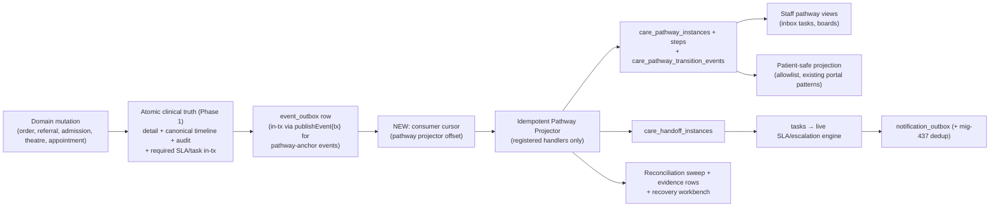

# Unified Care Pathways — Program Design (v2)

Status: **Design for owner review — no code changed.**
Provenance: revision of the GPT‑5.6‑Sol draft "VH Health Unified Care Pathways Plan"
(prepared read-only at `1e9618f52`). This revision was verified against
`github/main` **`de19f8b759ed1cd2b86f8cd6540b416abaa3f3c5`** on 2026‑07‑14 by
direct code inspection plus five read-only survey agents; every claim below
carries a `path:line` anchor at that SHA. Line numbers drift — re-derive before
citing in build prompts.

Cross-review verdict on the Sol draft: **APPROVE WITH CHANGES.** The central
architecture (one reusable spine, coordination layer distinct from clinical
truth, strict closed-loop closure semantics, shadow-first rollout) is correct
and worth keeping. Six findings materially change the design or the delivery
order; they are folded in below.

The OBGyn merge train is active and has already advanced past Sol's snapshot
(#583 merged after it; the current train's file surface includes
`maternityService.js`, `patientPortalRoutes.js`,
`appointmentWorkflowController.js`). Any implementation session must rebase and
re-run the file-overlap preflight against then-current `github/main`.

---

## 0. What changed from the Sol draft

| # | Sol draft said | Verified reality | Change in this revision |
|---|---|---|---|
| 1 | "Durable event outbox → idempotent Pathway Projector" (target diagram) | `event_outbox` is **single-consumer and status-mutating**: the 2-min drain claims rows `pending→processing→delivered` (`services/events/eventOutboxService.js:161-194`, `utils/scheduler.js:428-455`) and is hard-wired to the webhook pipeline (`scheduler.js:404-407,445`). No consumer cursor exists anywhere (repo-wide grep: zero `consumer_inbox`/cursor matches — the BEAM design that reserved one was deferred). A second reader would be starved. | **New Wave‑1 deliverable: a consumer-cursor substrate** (§3.3). This also starts ROADMAP §0 T2 epic #3 ("typed event/outbox bus") instead of duplicating it. |
| 2 | "Harden the existing workflow foundation" | mig‑118 splits into two halves. **Live:** `tasks` (producers: results inbox, death cert, cold chain, cath, NPS, teleconsult), seeded `escalation_rules` (mig 312:34) + a 2-min escalation cron, and mig‑269 `workflow_sla_instances` (used by referrals, stroke, STEMI, porter). **Dormant scaffolding:** `workflow_definitions/runs/steps` — one admin CRUD caller each (`tasksWorkflowRoutes.js:185,217`), zero seeded definitions, and **no execution engine at all** (`taskService.js:1083`: "engine left to a follow-up"). | Honest framing: we **finish building** the run/step runtime on the dormant tables (clean schema, no backward-compat drag) while **reusing** the live task/SLA/escalation loop as-is. §3.4 lists the exact build items, each anchored to a verified defect. |
| 3 | Escalation reuse row implies working machinery | The escalation engine only evaluates `escalation_rules` with `scope='task'` (`escalationEngineService.js:414,450`); `workflow_step`/`approval` scopes are never swept, no job flips an idle SLA instance to `breached`, and the breach backfill covers only `critical_result_ack` (`:63,577`). The seeded `referral_response` SLA (mig 269:226, 60 min, CMO escalation roles) is **inert** — an unseen referral escalates to nothing. | **Task-first rule** (§3.5): every human-actionable pathway stage materializes a `tasks` row, so the live engine covers it without new scopes. Plus one generic **breach sweep** for orphaned SLA instances (§3.7). |
| 4 | Six pathway gaps as stated | Mostly right, but several loops are further along than the draft's table: the **lab critical-result closed loop already exists end-to-end** (owner task + `critical_result_ack` SLA + T1/T2/T3 escalation + ack endpoint — `resultsInboxService.js:103-171`, `clinicalInboxRoutes.js:31-55`); the **discharge readiness gate already blocks** on `PENDING_RESULTS`, `PENDING_RADIOLOGY`, `FOLLOWUP_NOT_BOOKED`, unpaid invoice, open consults (`admissionService.js:2419-2637`); **readmissions auto-link** `prior_admission_id` (`:709-722`); **patient result release policy exists** (sign-off gate + 24 h auto-release + doctor hold, `portalAccessService.js:23-119`, mig 294); ED already models **LWBS / left-against-advice** as statuses and dispositions (`edOperationsService.js:34-54`). | §2.2 catalogs what already closes loops so pilots are scoped as **extension, not invention**. Wave‑3 (Diagnostics/Referral) gets cheaper; Inpatient's "pending results owner" becomes an explicit owner decision (D3) because today's model is *hard block*, not *unowned*. |
| 5 | No mention of in-repo pathway prior art | Stroke (mig 506) and STEMI (mig 559) already implement **append-only, sequence-numbered pathway event tables** FK-linked to `workflow_sla_instances`, canonical timeline and audit rows, with explicit `clock_start_pending` SLA semantics (mig 562). Cath readiness (482), porter (455/456), cold-chain (392) also consume the SLA table. | §4.1: these remain authoritative for their intra-encounter clocks (v1 non-goal to re-platform). The spine's transition-event table **copies their proven shape** (§3.6). DoD reworded accordingly (§10). |
| 6 | OBGyn addressed only as a parallel-lane constraint | The OBGyn journey program is building in the same conceptual space: its P4 is "state-aware reminders" on the mig‑437 engagement dedup ledger (now wired into `engagementCampaignService`), and its C3 outbox fix (PR #576) is **merged** (`notificationOutbox.js:45` now casts recipient_id `::text`). | §4.2 defines convergence: the spine owns the reminder/SLA/handoff rails; OBGyn P4+ consumes them. Prevents building two reminder engines. |

Smaller corrections folded in: `tenants.settings` JSONB originates in mig 013:18
(not mig 351 — 351 is composition-search settings); "OP Workspace" has **no
backend service** (staff-side client assembly over queue services) so "extend
the OP Workspace" means the staff app surface plus new backend endpoints; the
name "workflow runs" collides with the unrelated `clinical_ai_workflow_runs`
(mig 109), so all new tables keep the `care_pathway_*`/`care_handoff_*` prefix;
two body-actor seams survived the July audit codemod
(`tasksWorkflowRoutes.js:66` `created_by: b.created_by || req.user?.uid`;
`:318` `req.user?.uid || req.body?.approver_uid`).

---

## 1. Executive decision (unchanged core, corrected framing)

Do **not** build six independent pathway engines, and do not buy/port an
external workflow engine. Build **one Pathway Spine**: a coordination layer
over the existing clinical sources of truth.

The spine **never**: invents diagnoses, auto-approves clinical decisions,
advances a stage on AI output, silently closes unresolved work, or becomes a
second clinical record. Feature tables (appointments, admissions,
emergency_visits, referrals, investigations, ot_schedules, …) remain the
clinical source of truth; the canonical timeline/audit invariant
(`CLAUDE.md:51`, `docs/CANONICAL_CLINICAL_TIMELINE.md:73-95`) remains binding
and is the spine's anchor stream, not something the spine replaces.

Two reliability classes, named by the platform's existing convention
(`apps/backend/CLAUDE.md`, "Phase 0/1/1.5/2 transaction boundary rule"):

1. **Safety-critical records** — detail row + canonical timeline + audit +
   required SLA/task — persist atomically with the originating mutation
   (Phase 1, in-tx). This is already how lab sign-off, handover, discharge-sign
   and referral transitions behave (`labResultsService.js:633,781`,
   `handoverService.js:287`, `dischargeSummaryGenerator.js:1319`,
   `referralService.js:420-927`).
2. **Coordination projections** — pathway instance state, dashboards,
   notifications — are post-commit (Phase 1.5 / consumer), durable, idempotent,
   replayable, and visible in a recovery queue. A projector outage must never
   erase or contradict clinical truth, and no required safety task may depend
   solely on the projector running.

---

## 2. Verified repository position

### 2.1 Spine substrate today

| Asset | State | Evidence |
|---|---|---|
| `workflow_definitions/runs/steps` (mig 118) | Dormant CRUD scaffolding; JSONB steps; no engine; non-atomic start; blind transitions; no history; no duplicate-run guard | `taskService.js:745-814` (run INSERT `:766`, per-step INSERTs `:787-808`, silent step skip `:791`, dup swallow `:806`); blind UPDATEs `:847-878`, `:901-939` |
| `tasks` + `task_comments` | **Live.** Legal-transition map exists (`:47`, checked `:389-401`) but read-then-write (TOCTOU `:422`); `acknowledgeTask` does CAS (`:472-518`); one-open-task-per-resource dedup (mig 312:27, `createTask` `:245`) | `taskService.js`; producers: `resultsInboxService.js:149`, `deathCertificationService.js:247`, `coldChainService.js:10`, cath/NPS/teleconsult |
| `approvals` | CRUD + pending-check without CAS (`:992-1009`) | `taskService.js` |
| `escalation_rules` + engine | **Live**, seeded (mig 312:34); cron `*/2` (`scheduler.js:706`); `scope='task'` only; fires via `notificationOutbox` (`escalationEngineService.js:166`) + T1/T2/T3 once-per-tier (`:253-382`) | as cited |
| `sla_definitions` (mig 118) + `automation_rules` (mig 118:298-314) | Dormant, zero consumers | grep-verified |
| `workflow_sla_instances` (mig **269**, not 118) | **Live, polymorphic** (`source_table`+`rule_code`): referrals (`referralService.js:445`), stroke/STEMI/porter/cold-chain; supports pending clocks (mig 562) | as cited |
| Tenancy | All nine mig-118 tables carry `tenant_id` + RLS retrofitted in mig 304 (L127-216); service queries carry explicit tenant predicates | mig 304 |
| Event outbox | Single-consumer webhook feeder; statuses pending/processing/delivered/failed; MAX_ATTEMPTS 7; dead-letter has **no requeue endpoint** (`routes/admin/eventOutboxRoutes.js` — list/mark only) | mig 009:318-338; `eventOutboxService.js:13-16,125,161-259` |
| `publishEvent` | Dual-mode: `tx` param → in-tx atomic, re-thrown (`:104-107`); no tx → post-commit swallowed (`:109-119`). ~200 event types from ~40 producers; **appointments and billing emit nothing to the outbox** | `eventOutboxService.js:56-120` |
| Notification outbox | UPPERCASE statuses, retry<3, 2-min drain (`scheduler.js:577`); recipient_id `::text` fix **merged** (PR #576) | `notificationOutbox.js:9-19,45` |
| Engagement dedup ledger (mig 437) | Wired into `engagementCampaignService.js`; suppression events table alongside | mig 437 |
| Flag/shadow precedents | `careTeamEnforcement.js:36-38,76` and `ledgerAuthoritativeMode.js:21-30,53,84` — both `off/shadow/enforce` resolved from `tenants.settings` (mig 013:18) via `tenantSettingsService.js:58` | as cited |
| Reconciliation precedent | `reconcileLedger` per-tenant sweep + `reconciliation_checks` rows (mig 349) + `ledger-reconciliation-evidence.mjs` clean-streak **flip gate** (48 clean sweeps + 7-day span) | `ledgerReconciliation.js:93-192` |
| Scheduler | ~55 crons, all `withJobLock` (in-process set + `pg_try_advisory_lock` on a dedicated client, `scheduler.js:83-178`) | as cited |
| Patient projection precedents | `PATIENT_VISIBLE_NOTE_TYPES` allowlist + filter clamp (`patientPortalService.js:1144,1154`); `PATIENT_VISIBLE_DISCHARGE_STATUSES=['signed','delivered']` (`:1435`); result release policy (mig 294; `portalAccessService.js:23-119`); What's Next = `carePlanService.getPatientWhatsNext:1024-1108` behind `GET /care-plans/whats-next` (`patientPortalRoutes.js:167`) | as cited |

### 2.2 Loops that already close (build on, do not rebuild)

- **Lab critical results:** verified critical → `tasks` row assigned to the
  ordering clinician with DUTY-role fallback + `critical_result_ack` SLA
  (`resultsInboxService.js:103-171`) → 2-min T1/T2/T3 escalation → clinician
  ack endpoint (`clinicalInboxRoutes.js:31-55`) with CAS + audit comment. This
  **is** the closed-loop acknowledgement pattern the program needs; Diagnostics
  extends it to radiology/AP and to non-critical abnormals.
- **Patient release of results:** portal reads require `signed_off_at` +
  `release_hold=false` + (explicit release or 24 h auto-release)
  (`patientPortalService.js:2040-2069`, `portalAccessService.js:23-38`);
  doctor hold requires a reason; preliminary results are suppressed by
  construction.
- **Discharge readiness:** typed blockers incl. `PENDING_RESULTS`,
  `PENDING_RADIOLOGY`, `DISCHARGE_CONSULTS_PENDING`, `UNPAID_INVOICE`,
  `FOLLOWUP_NOT_BOOKED` (`admissionService.js:2419-2637`); Discharge Hub
  aggregates them (`:2639-2680`); 7-day readmission auto-link (`:709-722,911`).
- **Referral canonical + first-response SLA:** every transition emits canonical
  events in-tx (atomicity test exists:
  `tests/referral-canonical-atomicity.deep.test.js`); `referral_response` SLA
  runs request→first-seen/accept (`referralService.js:445,710,865,949`).
- **ED:** full visit state machine with LWBS/against-advice as first-class
  statuses and dispositions (`edOperationsService.js:34-83`); trauma workbench
  (migs 519-521) adds team-role accept/arrive acks and MLC completeness gates.
- **Theatre:** hard closure gates verified — consent, time_out, sign_out,
  finalized+signed anaesthesia and intraop notes, all instrument counts,
  booked-surgeon signoff (`theatreService.js:267-410,585-608`).
- **Offline clinical writes:** queued writes replay with client timestamps and
  stable idempotency keys (vhhealth_core `OfflineQueue`/`ConnectivitySyncService`);
  MAR/CPOE/e-Rx wired.

### 2.3 Verified continuity gaps (the program's actual work)

| Pathway | Where the loop stops today | Evidence |
|---|---|---|
| Diagnostics | Non-critical results: sign-off → release → order `COMPLETED`; **no orderer disposition concept exists** (repo-wide grep). Radiology/AP stop at sign-off — no inbox task, no critical-comms, only a TAT-breach alert (`radiologyService.js:484-514`). **Amendments re-enter nothing**: a `corrected` lab sign-off skips patient re-notify, task enqueue and critical re-detection (all gated `decision==='verified'`, `labResultsService.js:814,880`); radiology/AP addenda are append-only with no re-ack (`radiologyService.js:833-899`, `pathologyService.js:775-832`). Specimen reject/recollect exists at investigation level (`investigationService.js:1195-1268`) but `lab_specimens` has no rejected state (`labClosedLoopService.js:133-189`). No pending-at-discharge ownership concept (block-only model). | as cited |
| Referral | Specialist `completed` is terminal; **no originator acknowledgement field/flow anywhere** (baseline cols :15633-15657). Response is unstructured free text, unsigned; staff and admin UIs complete with no notes (`referrals_screen.dart:197`, admin `page.tsx:182`). **Nothing fires on SLA breach** (§0 row 3). No re-route, no expiry, no appointment/no-show link (`referrals` has no `appointment_id`), no duplicate-active guard (unique index = `referral_number` only, baseline :30952). UI shows `in_progress/cancelled/expired` that the backend never writes. **No patient referral surface** (patient app grep = 0; the one patient-scoped route is clinical-only, `referralRoutes.js:39-41,351`). | as cited |
| OP | `COMPLETED` is terminal; no per-visit tracking that ordered tests/referrals/prescriptions completed; `follow_up_plans` written only manually via `carePlanService.createFollowUp:794-886`; no-show handling = reaper flips stale `SCHEDULED→MISSED` (`appointmentReaperService.js:1-29`), no recovery outreach; appointments emit no outbox events. | as cited |
| Inpatient | Gate-blocked discharge is strong, but blockers lack named owners (`discharge_consults` has requester/completer, no owner-role, mig 173:61-75); no post-discharge contact concept (a *booked* follow-up ≠ an outreach); no discharge-with-named-results-owner alternative to the hard block. | as cited |
| Emergency | ED→ward is push-with-no-accept: creating the admission closes the ER chart (`admissionService.js:528-560,943-953`); no destination-acceptance ack; no aftercare/callback concept — `follow_up_plans.origin_kind='er_visit'` exists in schema (mig 122:176) but nothing writes it. | as cited |
| Surgery | `completed` is terminal (`VALID_TRANSITIONS.completed=[]`, `theatreService.js:26-34`); specimens are a free-JSON array on intraop notes with **no pathology accession created** (`surgicalDocumentationService.js:459,545`); post-op follow-up is a free-JSON list, `origin_kind='ot_case'` never written; `sign_in` checklist phase is recordable but **not gated** (only time_out/sign_out gate, mig 116:314-315); no distinct pre-op clearance entity. | as cited |

Journey-test stopping points (extend these, don't only add new files):
walk-in-opd `:284` (timeline after COMPLETED), inpatient-admission `:251-253`
(**never reaches discharge**), emergency-walk-in `:227-228` (disposition),
surgical-day-care `:502-504` (discharge, with follow-up/consults test-seeded
`:440-460`), lab-walk-in `:234-237` (sign-off).

---

## 3. The Pathway Spine

### 3.1 Corrected target model

Two deltas from the Sol diagram: the **consumer cursor** exists as a first-class
box (it is net-new), and human-actionable coordination work always lands in
**`tasks`** so the live escalation engine covers it (no new escalation scopes
in v1).

### 3.2 Reuse map (corrected and extended)

| Requirement | Reuse | Note |
|---|---|---|
| Definition/version | `workflow_definitions` | + validation & governance (§3.4, §3.5) |
| Runtime & stages | `workflow_runs`, `workflow_steps` | after the §3.4 build items |
| Human work | `tasks`, `task_comments` | task-first rule §3.5 |
| Approvals | `approvals` | + CAS fix |
| Time limits | **mig-269 `workflow_sla_instances`** (+ its `sla_rules`) | *not* mig-118 `sla_definitions` (dormant; leave dormant) |
| Escalation | `escalation_rules` + engine, `scope='task'` | via task-first rule |
| Event→pathway triggers | **new projector** consuming the outbox via cursor | `automation_rules` stays dormant — decision D2 |
| Longitudinal goals / follow-ups | `care_plans*`, `follow_up_plans` (incl. dormant `origin_kind='er_visit'/'ot_case'` seams, mig 122:176) | |
| Clinical history | `clinical_timeline_events`, `clinical_audit_events` | unchanged invariant |
| Business events | `event_outbox` (+ new cursor) | |
| Patient/staff comms | `notification_outbox` + **mig-437 engagement dedup/suppression ledger** | reminders ride the ledger — shared with OBGyn P4 |
| Patient "next steps" | `carePlanService.getPatientWhatsNext` + portal route | extend, don't fork |
| Result release policy | mig 294 release/hold/proxy machinery | Diagnostics patient surface |
| Guardian/dependent access | `users.guardian_user_id` (mig 202) + X‑Acting‑As chain | |
| Rollout | `tenants.settings` mode key + shadow/enforce resolver pattern; `reconciliation_checks`-style evidence + clean-streak flip script | copy ledger/careTeam precedents |

### 3.3 Event substrate: the consumer cursor (new, Wave 1)

Problem (verified): the outbox drain destructively consumes rows; a projector
cannot read independently. Design:

- `event_consumer_offsets(consumer_key PK-part, tenant-agnostic, last_event_id BIGINT, updated_at)`
  — one row per consumer. The projector polls
  `event_outbox WHERE id > last_event_id ORDER BY id LIMIT n` (id is BIGSERIAL,
  widened in mig 347; the `(status, available_at, id)` index gains a plain
  id-range scan for free). The existing drain and its statuses are untouched —
  `status` remains the webhook pipeline's private state.
- Projector idempotency: per-event handler dedup on
  `(consumer_key, event_id)` via a small `pathway_projector_inbox` unique
  index, mirroring the BEAM plan's `consumer_inbox` concept (deferred design,
  now landed Node-side, single consumer to start).
- Ordering: id-order within the poll; handlers must tolerate re-delivery and
  out-of-order across domains (each keys on domain-record ids, not sequence).
- **Emitter gaps to close per pathway** (in-tx `publishEvent({tx})` at the
  domain write): appointment lifecycle events (none exist today) for OP;
  ED visit transitions; theatre case transitions where missing. Referral and
  lab already emit.
- Replay: a cursor rewind is the replay mechanism (projection tables are
  rebuildable); dead-letter recovery gets the missing **requeue/redrive**
  admin action (`failed→pending`) — closing a real hole
  (`eventOutboxRoutes.js` has list/mark only).
- Decision **D1**: projector source = outbox cursor (recommended; advances T2
  #3, one event spine, replay semantics) vs a cursor over
  `clinical_timeline_events` (append-only and in-tx guaranteed, but clinical-
  only and not a queue). Recommendation: outbox cursor, with the pathway-anchor
  emitters made in-tx.

### 3.4 Runtime build list (was "foundation hardening" — every item maps to a verified defect)

1. Atomic start: run INSERT + full step materialization in one
   `setTenantTx`; reject (don't skip) malformed steps — fixes
   `taskService.js:787-808,791,806`.
2. Definition schema validation at create/activate (per-step key/kind/role
   shape; registered trigger/condition/action identifiers only — the engine
   executes **no stored expressions**; grep confirms none exist today, keep it
   that way).
3. Legal-transition maps + compare-and-set (`WHERE status = $expected`) for
   runs, steps, tasks (`transitionTask` TOCTOU `:422`), approvals (`:992-1009`).
   `AppError.invalidTransition` on violation.
4. Append-only transition history: `care_pathway_transition_events` (§3.6).
5. Duplicate-instance guard: partial unique index on
   `(tenant_id, pathway_key, source_episode_type, source_episode_id) WHERE status IN (active,…)`
   + durable idempotency key on start (copy `uq_task_open_per_resource`
   precedent, mig 312:27).
6. Actor provenance: actor always from `req.user`; fix the two body seams
   (`tasksWorkflowRoutes.js:66,318`); transitions record the actor (today they
   accept none, `:132,243,266`).
7. Route surface: pathway mutations move off the ADMIN-only workflow CRUD
   router onto pathway routes with role gates + `patientAccessGuard` +
   `phiAccessLogger` (the OR-board lesson from the July audit).
8. Definition lifecycle: activation = approval action (reuse `approvals`);
   active instances pin `workflow_definition_id`+version (already snapshotted
   at start, keep); published definitions immutable (no update path exists
   today — add version-bump-only editing, never in-place).
9. Generic SLA breach sweep: flip overdue `active` `workflow_sla_instances`
   to `breached` + ensure a task exists (generalize the `critical_result_ack`
   backfill, `escalationEngineService.js:63,577`) — cron via `withJobLock`.

### 3.5 Companion data model — minimality verdict

Sol proposed five tables. Verdict: **three new tables + one slim governance
companion; drop one.**

- **`care_pathway_instances`** (keep, 1:1 `workflow_runs`): tenant, patient_uid,
  encounter_id, pathway_key + pinned version, source episode (type, id),
  parent_instance_id, owning clinician/team + accountable role, clinical
  status (`planned/active/on_hold/completed/cancelled/transferred/entered_in_error`),
  completion outcome + closure reason, timestamps, idempotency key,
  patient-visibility status. Justified: `workflow_runs` has no
  patient/encounter/episode columns (mig 118:68-89) and must stay generic.
- **`care_pathway_transition_events`** (keep): copy the **proven
  `stemi_pathway_events` shape** (mig 559) — append-only trigger,
  `sequence_number` unique per instance, triggering event id, previous/new
  state, authenticated actor or system-job name, reason/override provenance,
  idempotency key, FKs to canonical timeline/audit rows. Do not invent a new
  shape.
- **`care_handoff_instances`** (keep — the genuinely new clinical concept):
  sending/receiving pathway+step, handoff type, source domain resource,
  urgency + policy due time, sender + intended recipient/team,
  `requested/acknowledged/accepted/declined/completed/closed_loop/cancelled`,
  decline/re-route reason, acceptance/completion/originator-closure
  timestamps, idempotency key. References — never replaces — the underlying
  referral/admission/transfer/appointment row. Every handoff with a human
  recipient materializes a `tasks` row (task-first rule) so escalation works
  day one.
- **Governance**: keep a **slim** `care_pathway_definition_governance`
  (1:1 `workflow_definitions`): clinical owner, operational owner, governance
  state (`draft/under_review/approved/retired`), approver + timestamp,
  patient-visibility policy ref, effective dates, checksum, and the
  non-removable platform gates list. Defer per-tenant customisation matrices
  and multi-approver chains until a second tenant actually customises
  (YAGNI; the platform is single-tenant-live today, `ALLOW_DEFAULT_TENANT=true`).
- **Drop `care_pathway_resource_links`** (v1): `tasks` already carries
  polymorphic `related_resource_type/id` + patient/encounter (mig 118:149-152),
  transition events carry the triggering event and canonical FKs, and
  `care_pathway_instances` carries the source episode. A generic link table
  adds an unconstrained polymorphic surface (no FK integrity, RLS + orphan
  sweep burden) before any consumer needs it. Revisit only when a concrete
  Wave‑4 view needs a link the above can't express — then add it enum-typed.

All new tables: `tenant_id` GUC-reading default + Pattern-A RLS in the same
migration (mig 304 retrofitting was a gap, don't repeat it); UUID PKs;
`workflow_runs.id` stays SERIAL — FK as integer.

### 3.6 Definition contract (v1 subset)

Every pathway definition version declares: entry triggers (registered event
types) + eligibility; natural episode key + duplicate policy; stages + legal
transitions; required vs optional stages; required domain artifacts per stage
(asserted by registered condition handlers reading domain tables — never
free-form expressions); accountable role + reassignment rules; SLA `rule_code`
references (values owner-signed, never invented — mig 562's
`clock_start_pending` semantics available); patient-visible stage label + safe
explanation; events that open/advance/block/transfer/reopen/close; child
pathway launch rules + blocking classification (§6); cancellation/no-show/
transfer/death/entered-in-error handling; manual override roles + mandatory
reason; closure evidence; metrics.

Deferred from v1 (YAGNI until a pilot needs them): parallel branch
choreography, conditional sub-graphs, per-tenant stage grafting. The two pilot
pathways are expressible as linear stages + task fan-out + handoffs.

### 3.7 Generic state rules

All of Sol's rules stand: no silent advancement; no transition on elapsed time
alone (reminders may be time-based; clinical completion may not); handoffs
incomplete until the receiver accepts; a response is not closed-loop until the
originator acknowledges or ownership is explicitly transferred; "recovered"
never inferred from inactivity; reopen = audited event or new linked episode;
overrides need capability + reason + audit; failed/stuck steps surface in a
recovery workbench; notification delivery ≠ understanding; patient ack never
substitutes for clinician ack of a critical result.

Added (grounded in this repo):

- **Dual timestamps everywhere:** `occurred_at` (clinical/bedside time, may
  arrive late via the offline queue) vs `recorded_at` (server ingest). SLA
  clocks run on `occurred_at` with a bounded-acceptance policy mirroring the
  MAR offline rule (reject >60 s future / >12 h old); replayed offline writes
  must not fire retroactive breach alarms — breach evaluation happens at sweep
  time with late-arrival grace (owner-signed).
- **Reminder dedup:** every patient-facing pathway reminder writes through the
  mig‑437 ledger (`UNIQUE(tenant_id, idempotency_key)` + suppression events) —
  one occurrence per (instance, stage, channel, day).
- **No invented clinical numbers:** SLA targets, reminder cadences, escalation
  recipients, release delays are owner/clinical-governance inputs (STEMI
  target-seeding precedent: seeded disabled, enable requires clock-definition
  provenance).

### 3.8 Patient and guardian projection

Staff data stays hidden by default; patient surfaces get an explicit
allowlisted projection: plain-language stage label, releasable completed
milestones, current next step, patient-owned actions, appointment/preparation
info, approved instructions + warning signs, escalation contact, released
documents/results.

Bind to the **existing** enforcement points rather than new ones:
`PATIENT_VISIBLE_NOTE_TYPES` intersect-only filtering
(`patientPortalService.js:1144-1154`) — the standing owner rule that **IP
notes never reach patients** is inherited; discharge content only
`signed/delivered` (`:1435`); results only via the mig‑294 release policy;
What's Next extended via `carePlanService`, not forked. Never expose triage
notes, intraop narrative, staff comments, differentials, internal blockers, or
unverified/preliminary results. Guardian access rides mig‑202
`guardian_user_id` + the X‑Acting‑As server-side match; sensitive categories
need their own release policy (owner input).

### 3.9 Rollout, reconciliation, recovery

- **Per-pathway mode key** in `tenants.settings`:
  `care_pathways: { <pathway_key>: off|shadow|active }`, resolved by a
  `resolvePathwayMode(tenantId, pathwayKey)` clone of
  `careTeamEnforcement.js`/`ledgerAuthoritativeMode.js` (default **off**;
  shadow = project + reconcile, no tasks/notifications/patient surface;
  active = full). Flips are operator actions recorded in the GO_LIVE flip
  registry.
- **Reconciliation sweep** (cron, `withJobLock`, per-tenant `setTenantTx`),
  detecting: domain records without instances; instances without source
  records; canonical events not projected (cursor lag); stages stuck beyond
  policy; missing safety tasks/SLA rows; terminal domain records with active
  stages; handoffs accepted-not-completed; completed-not-acknowledged
  responses; outbox/notification dead letters; duplicate active instances.
  Results append to `care_pathway_reconciliation_checks` (clone mig 349) and
  export via the reliability metrics module (`metricPrimitives.js`) with
  alerts in the existing PrometheusRule files.
- **Activation evidence:** clone `ledger-reconciliation-evidence.mjs` —
  a pathway flips shadow→active only on a clean-streak verdict
  (thresholds owner-set).
- **Recovery workbench:** admin surface over dead-lettered events (with the
  new requeue action), stuck instances, orphaned handoffs, and unowned tasks —
  staff recover without database surgery.
- **Backfill:** dry-run report per tenant first; backfill **active/open
  episodes only**; label inferred state + provenance; never generate
  historical canonical events; never send retrospective notifications;
  ambiguity routes to a human remediation queue.

---

## 4. Coexistence and convergence (new section)

### 4.1 Stroke / STEMI / cath pathway events

These remain **authoritative and untouched in v1** (owner-blessed, freshly
built, clinically live semantics — STEMI targets confirmed by the owner
2026‑07‑13). The spine targets *cross-encounter coordination* (order→action,
request→closure, admission→recovery); the `*_pathway_events` tables own
*intra-encounter time-critical milestone clocks*. Optional later: a read-only
adapter surfacing their state as informational pathway context. The DoD wording
in §10 reflects this.

### 4.2 OBGyn journey program

The OBGyn program (active train; see
`docs/superpowers/…` OBGyn plan + memory) needs exactly the rails this spine
builds: state-aware reminders (its P4 plans to reuse mig‑437 + notification
outbox), schedule/SLA clocks, and guardian-scoped patient projections.
Convergence rules:

1. The **spine owns the rails** (cursor, projector, reminder-dedup convention,
   handoff/task patterns, mode resolver). OBGyn P4+ consumes them; neither
   program builds a second reminder engine.
2. Until the spine's Wave 1 merges, OBGyn continues its committed course; any
   OBGyn reminder work lands behind the mig‑437 ledger so it is
   spine-compatible by construction.
3. File-overlap lanes: the OBGyn train currently touches
   `patientPortalRoutes.js`, `appointmentWorkflowController.js`,
   `maternityService.js`. Spine Waves 1–3 must not modify these three files;
   OP-wave work (which will) sequences after the train quiesces or via
   single-owner coordination.
4. ANC/immunisation journeys become pathway definitions **later** (post-Wave
   4), riding the same spine — listed as pathway #7/#8 candidates, not scoped
   here.

### 4.3 Existing coordination surfaces

Results inbox, Discharge Hub, Patient Command Board, queue displays: the spine
**feeds and reads** these; it never duplicates them. Concretely: pathway-created
work items are `tasks` (already the inbox currency); Discharge Hub's readiness
blockers become linkable stages of the inpatient pathway rather than a second
checklist.

### 4.4 `automation_rules` (mig 118) — decision D2

Leave dormant and document as superseded by the projector's registered-handler
config (recommended — the table's `action_kind='start_workflow'` vision is what
the projector implements, but config-in-code + definition triggers give
type-checked review; a DB-row rule engine invites unreviewed behavior).
Alternative: implement the projector's trigger matching *through*
`automation_rules` rows for per-tenant trigger tuning. Owner call; default =
leave dormant.

---

## 5. The six pathways

Sol's flows, branch lists, closure rules and metrics are adopted as written
unless amended below — they are clinically sound. Per pathway: what changes.

### 5.1 Diagnostics — `diagnostics_order_to_action` (pilot 1)

Reframed as **extension of the live lab critical loop** (§2.2):

- Extend `resultsInboxService` task creation to **radiology critical/urgent
  findings and AP malignancy/urgent diagnoses** (both currently stop at
  sign-off).
- Add the **orderer disposition record** (the one missing concept): a small
  `result_dispositions` detail row (result ref, orderer, action taken:
  `treated/repeated/referred/no_action`, note, in-tx canonical pair) — this is
  the "Ordering owner reviews and records action" stage's evidence.
- **Amendment/correction reopen** (also a live safety gap today): `corrected`
  sign-off and radiology/AP addenda re-run critical detection, re-notify, and
  re-open/re-create the inbox task (fixes `labResultsService.js:814,880`
  gating; `radiologyService.js:833-899`; `pathologyService.js:775-832`).
- Unify specimen rejection: give `lab_specimens` a `rejected` state feeding the
  investigation-level recollect flow (mig 245 pattern).
- Patient surface: already largely exists (release policy + portal results);
  add preparation/collection status + "discussed with your doctor" stage from
  the pathway projection.
- Closure rule, branches, metrics: per Sol §5, with normal-result auto-closure
  policy as owner decision D4.

### 5.2 Referral — `referral_request_to_closure` (pilot 2)

- Add **originator acknowledgement**: `acknowledged_by/at` + closure evidence
  on the referral row; `completed` stops being terminal-in-practice — closure
  requires ack, explicit ownership transfer, documented no-further-action, or
  policy-satisfied lost-to-follow-up (Sol's rule, adopted).
- **Structured, signed response**: response fields (findings/recommendation/
  urgency-of-action) + signer attestation; staff/admin UIs currently submit
  none (`referrals_screen.dart:197`, admin `page.tsx:182`).
- **Make the SLA real**: breach sweep (§3.4 item 9) creates an escalation task
  for unseen referrals — the seeded CMO escalation roles stop being inert.
- Add re-route, expiry policy, `appointment_id` linkage (no-show propagation),
  duplicate-active guard (partial unique or preflight warn — owner call on
  hard-block vs warn).
- Reconcile UI-only statuses (`in_progress/cancelled/expired`) with the
  backend machine; add `FOR UPDATE` row lock on accept/decline (TOCTOU).
- Patient surface: net-new (status, destination, preparation, approved next
  steps) — allowlisted projection only.
- External referrals: keep v1 thin — external destination record +
  counter-referral report-back capture; full provider directory is out of
  scope.

### 5.3 OP — `op_contact_to_recovery` (Wave 4)

- Emit appointment lifecycle events (none today) in-tx; project the visit
  pathway.
- **Visit-generated work tracking**: orders/referrals/prescriptions created
  during the encounter link to the OP instance (via `tasks.related_resource_*`
  + instance FK); appointment `COMPLETED` closes the *visit*, the pathway
  closes per Sol's rule (children complete or ownership accepted + next steps
  delivered + follow-up disposition recorded).
- No-show recovery: reaper's `MISSED` flip becomes a pathway branch with a
  recovery task queue (today it is bookkeeping only).
- Follow-up: auto-create `follow_up_plans` from the clinician's disposition
  (reuse `createFollowUp`'s auto-reserve seam, `carePlanService.js:870-880`).
- Staff surface: extend the staff-app OP flow + a backend "unresolved
  visit-generated work" endpoint — there is **no** backend OP-workspace
  service to extend today; plan the endpoint, reuse the staff screen.

### 5.4 Inpatient — `inpatient_admission_to_recovery` (Wave 4)

- The readiness gate and Discharge Hub stay authoritative; the pathway wraps
  admission→discharge→post-discharge as one instance and gives **blockers named
  owners** (task per blocker).
- **D3 (clinical owner decision):** pending-results-at-discharge = keep the
  hard block (today's model) or allow discharge with a named post-discharge
  results owner (Sol's model). The spine supports both; policy chooses.
- Post-discharge: policy-defined contact/outreach stage (booked follow-up ≠
  contact) riding notification outbox + mig-437 dedup; readmission linkage
  already exists — surface it as pathway reopen/linked-episode.
- Medication reconciliation evidence, education, transport/destination fields:
  per Sol §8 closure list (owner signs the exact evidence set).

### 5.5 Emergency — `emergency_arrival_to_aftercare` (Wave 5)

- **Destination acceptance**: admit/ICU/surgery dispositions create a
  `care_handoff_instances` row requiring receiving-side accept (task to the
  receiving unit role); ED chart closure no longer implies acceptance
  (`admissionService.js:943-953` behavior preserved, acceptance layered on).
- Aftercare: discharge-home dispositions get policy-defined aftercare tasks +
  the dormant `follow_up_plans.origin_kind='er_visit'` seam; LWBS/against-
  advice (already statuses) get risk-classified recovery-contact queues.
- Transfer-out: summary + transport confirmation evidence per Sol.
- MLC/death: keep existing MLC completeness gates (`edOperationsService.js:877-957`)
  as required stage artifacts, separated from family-visible info.

### 5.6 Surgery — `surgery_decision_to_recovery` (Wave 5)

- Upstream: surgical decision + pre-op optimisation stages over existing
  `preop_checklists` + OT-ready gates; clearances get a detail record (none
  exists today).
- **D7 (owner):** gate `sign_in` like time_out/sign_out (currently recordable
  only), with override provenance.
- Downstream: theatre `completed` triggers specimen→**AP accession** handoff
  (replacing the free-JSON dead end), post-op follow-up auto-create
  (`origin_kind='ot_case'`), pathology-result acknowledgement rides the
  Diagnostics loop, complication/reoperation branches link back to the same
  instance.
- WHO checklist, counts, signoff gates: already enforced — the pathway
  *references* them as stage evidence; it never re-implements them.
- Family-status communication: explicit recipient/consent policy (owner input)
  before anything ships.

---

## 6. Cross-pathway handoff rules

Adopted from Sol unchanged: origin→child matrix (OP/ED/IP/Surgery/Referral/
Diagnostics) and the four-way classification — **blocking**,
**ownership-transferring**, **nonblocking-with-named-owner**,
**informational**. No parent may abandon a child merely because the parent
encounter ended. Every classification is declared in the definition contract
(§3.6) and enforced by the closure evaluator, not by convention.

---

## 7. Delivery plan (reshaped)

Sol's Waves 0–6 become **S0–S6 with a vertical-first pilot**. Rationale: Sol's
Waves 0–2 are ~all horizontal infrastructure with no user-visible value and a
six-pathway dossier gate up front; this reshape scopes Wave-0/1 work to what
the pilot needs and proves the spine on one pathway end-to-end before
horizontal spread. Sol Wave N ↔ slice mapping noted per slice.

Per repo convention, **each slice gets its own spec + implementation plan**
(brainstorm→design→plan cycle, `docs/superpowers/{specs,plans}/`) before build;
migration numbers come from the playbook registry at build time (two files
already share `574` — verify `ls src/migrations | sort -V` and never reuse; 577
is next free at the time of writing).

- **S0 — Decision dossier (thin).** [was Wave 0] §2 of this document *is* the
  six-pathway current-state audit. Remaining S0 work: owner signs the pilot
  pathways' closure semantics + patient-visibility policies + D1–D7; clinical
  and operational owner named per pilot pathway. Gate: decisions recorded (the
  sign-off-decisions memory pattern). No engineering-invented timings.
- **S1 — Spine substrate.** [Wave 1 + the missing cursor] Consumer cursor +
  projector skeleton (registered handlers, idempotent, replay-tested) +
  runtime build list §3.4 (atomic start, CAS, transition events, instance +
  handoff + governance tables, duplicate guard, actor provenance, breach
  sweep) + mode resolver + reconciliation table/sweep + outbox requeue admin
  action. Gate: substrate deep tests green — rollback, concurrency (two
  concurrent transitions, one wins), tenant isolation, actor attribution,
  replay-idempotency; full chunked gate green.
- **S2 — Diagnostics pilot.** [Wave 2 + first half of Wave 3] Shadow
  projection of the diagnostics pathway from live events on the pilot tenant;
  reconciliation drift report clean; then staff loop (radiology/AP inbox
  extension, disposition recording, amendment reopen), then patient projection
  delta; evidence-gated shadow→active flip. Gate: no unowned/unacknowledged
  critical result in pilot evidence; drift zero across the evidence window.
- **S3 — Referral pilot.** [second half of Wave 3] Ack loop + structured
  signed response + live SLA escalation + re-route/expiry + patient view;
  same shadow→evidence→active sequence. Gate: zero completed-but-unowned
  referrals in evidence.
- **S4 — OP + Inpatient.** [Wave 4] Parallel lanes after S2/S3 stabilize the
  handoff + child-tracking contracts. OP lane sequences behind the OBGyn train
  on the three shared files (§4.2). Gate: appointment completion and discharge
  can no longer hide unresolved ownership.
- **S5 — Emergency + Surgery.** [Wave 5] Parallel lanes. Gate: every terminal
  ED/theatre state has a valid destination acceptance or closure outcome.
- **S6 — Unified patient experience + rollout.** [Wave 6] One "what happens
  next" model across pathways; multilingual + accessibility states; deep
  links; tenant-by-tenant activation via flip registry; dashboards, runbooks,
  rollback drill; post-launch safety review.

Single-owner hotspots (unchanged from Sol, refined): `taskService.js` and the
new spine services; pathway migrations; `canonicalClinicalPlatformService.js`;
`eventOutboxService.js`/`scheduler.js`; `notificationOutbox.js`; shared Dart
models; patient + staff navigation; and (until the train quiesces)
`patientPortalRoutes.js` + `appointmentWorkflowController.js` +
`maternityService.js`.

Platform integration requirements for every slice (build-prompt checklist):
`openapi:check` after any route change; new tables = GUC tenant default +
Pattern-A RLS in-migration + seeder `TABLE_COLUMN_SEED_OVERRIDES` when CHECKs
demand; new admin pages extend the proxy `ALLOWED_PATH_PREFIXES`; staff-app
strings via `AppStrings` (patient app via ARB); new service imports ripple into
`jest.unstable_mockModule` suites (sweep mock-based consumers); wire-shape
normalizers handle Prisma `Decimal`; deep tests run per the chunked-runner and
worktree rules.

## 8. Test strategy

- **Spine conformance suite (write once in S1):**
  `pathway-spine-substrate.deep.test.js` (atomic start incl. induced mid-
  materialization failure → zero rows; illegal transition rejected; concurrent
  transition — exactly one wins; duplicate episode start → conflict; actor
  attribution; tenant isolation + RLS; IDOR),
  `pathway-projector-replay.deep.test.js` (same event twice → one transition;
  cursor rewind → identical projection; out-of-order tolerance),
  `pathway-reconciliation.deep.test.js` (each drift class detected + evidence
  row written).
- **Per-pathway:** extend the five existing journey tests beyond their current
  stopping points (§2.3 line anchors) *and* add
  `diagnostics-order-to-action.journey.test.js`,
  `referral-request-to-closure.journey.test.js`, then one per Wave-4/5 pathway
  plus `cross-pathway-handoffs.journey.test.js`. Branch/edge coverage per
  pathway follows Sol's §14 matrix, applied per-pathway only for
  pathway-specific behavior — spine generics are proven once in the
  conformance suite, not re-proven six times.
- Tests assert exact statuses (repo rule: never accept 500 as alternate
  success). Failure-injection (projector down, outbox dead-letter,
  notification failure) uses the discharge-sign atomicity test's
  `unstable_mockModule` pattern.

## 9. Decisions required before activation

Owner/clinical (blocking the relevant slice, not S1): D1 projector source
(rec: outbox cursor); D2 `automation_rules` fate (rec: dormant); D3 pending-
results-at-discharge block-vs-owned-discharge; D4 normal-result auto-closure;
D5 abnormal-noncritical required action; D6 originator-ack rules + ownership
transfer; D7 surgical `sign_in` gating; D8 stroke/STEMI stay-as-is confirmation
(rec: yes, v1); D9 OBGyn convergence sequencing (rec: rails-first, P4
consumes); plus Sol's standing list — SLA values + business-hours + escalation
recipients per pathway; patient/guardian visibility + notification policy;
meaning of patient "acknowledged" vs delivered/opened; external-provider
communication method; manual override/break-glass policy; backfill scope (rec:
active episodes only); retention; duplicate-referral hard-block vs warn;
LWBS/against-advice recovery policy; post-discharge contact policy; family
updates during ED/Surgery; tenant customisation surface.

## 10. Program definition of done

- The six pathways run on the shared spine; **no second generic pathway
  engine exists** (domain state machines remain authoritative; stroke/STEMI/
  cath pathway-event tables remain authoritative for intra-encounter clocks).
- Every active stage has an accountable person or role; every safety-critical
  handoff is acknowledged or escalated; every terminal state has closure
  evidence; required child work cannot be silently abandoned.
- Duplicate/retry/concurrency protections proven on PostgreSQL (conformance
  suite); canonical timeline/audit/task/SLA coverage complete per the
  invariant; patient projections allowlisted and privacy-tested; reconciliation
  detects and surfaces drift with durable evidence rows; staff recover
  failed/stuck work without database surgery; patient apps show understandable
  next steps.
- Per-tenant, per-pathway activation went shadow→evidence→active via the flip
  registry; rollout and rollback runbooks exercised; clinical, operational,
  privacy and product owners signed the pilot evidence.

## 11. Quick wins independent of the program

1. **Amended/corrected result safety gap (do now):** `corrected` lab sign-off
   skips critical re-detection, patient re-notify and inbox task
   (`labResultsService.js:814,880`); radiology/AP addenda have no re-ack loop.
   Small, self-contained fix + deep test; also shrinks S2.
2. **Referral status drift:** staff/admin UIs render `in_progress/cancelled/
   expired` the backend never writes — align now or fold into S3.
3. **Outbox dead-letter requeue:** add `failed→pending` redrive to
   `eventOutboxRoutes.js` — operational gap worth having regardless.
