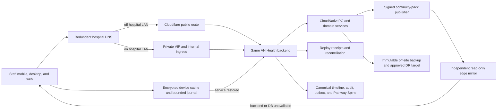

# VH Health Clinical Service Continuity and Downtime Resilience

**Date:** 2026-07-28

**Status:** cross-review draft — not approved for implementation or production

**Review baseline:** `5407259b9311fd3a610d9890328186703199385f`

**Baseline commit time:** `2026-07-28T12:35:12+05:30`

**Baseline commit:** merge of PR #633, journey-harness SLA/task teardown correction

## 1. Outcome

Temporary loss of the internet, Cloudflare, one server, one database node, a
backend service, or a ward device must not stop safe patient care.

The target is layered continuity:

1. keep the normal VH Health backend fully usable over the hospital LAN when
   the internet-facing route is unavailable;
2. keep a small, signed, current-enough, read-only clinical view available when
   the backend or database is unavailable;
3. capture only explicitly approved low-risk work offline;
4. route physical high-risk work to controlled paper procedures and a governed
   back-entry workflow;
5. replay and reconcile every captured item without losing, duplicating, or
   silently changing the clinical fact; and
6. prove restore and failover for a site, storage, or cyber disaster.

This design does **not** promise that every electronic action remains available
during every outage. A safe, clearly restricted downtime mode is preferable to
an apparently functional screen that can create an unsafe order, administer
against stale data, or silently lose the record.

## 2. Scope boundary

### 2.1 In scope

- hospital-LAN access to the full Staff API without a working ISP or
  Cloudflare path;
- on-premises service, control-plane, database, storage, DNS, network, and
  power continuity;
- independent read-only downtime packs and Staff-device continuity caches;
- a versioned, signed, default-deny offline action policy;
- safe offline draft capture, occurrence-time preservation, idempotent replay,
  conflict handling, and clinical reconciliation;
- paper-to-electronic back-entry for actions that cannot safely use ordinary
  replay;
- dependency-outage behavior for laboratory, radiology/PACS, pharmacy,
  notification, identity, ABDM/FHIR, and other integrations;
- backup immutability, restore proof, cyber isolation, and cross-site disaster
  recovery;
- clinical, operational, privacy, security, and product activation evidence.

### 2.2 Explicit non-goals

- no active-active, multi-writer copy of the clinical database;
- no second EMR, task engine, pathway engine, SLA engine, or clinical record;
- no client-side execution of Unified Care Pathways;
- no invented clinical timing, freshness, medication, identity, escalation,
  or break-glass rule;
- no generic promise that electronic prescribing, administration, specimen
  collection, transfusion, signing, discharge, or critical-result
  acknowledgement works offline;
- no production deployment or activation from this document.

### 2.3 Relationship to Unified Care Pathways

This is a horizontal resilience program, not a seventh care pathway and not the
longitudinal patient "What Happens Next" product planned for S6.

Offline recovery must call the existing domain service. That service remains
responsible for the detail record, canonical timeline, clinical audit, SLA,
outbox event, and any Pathway Spine projection. A device must never write a
care-pathway transition directly.

The pathway program already requires separate `occurred_at` and `recorded_at`
semantics and owner-approved late-arrival behavior
(`docs/superpowers/specs/2026-07-14-unified-care-pathways-program-design.md:431-460`).
Replayed work follows that rule: an old physical event does not automatically
create a retrospective alert or rewrite an authoritative Stroke/STEMI clock.

Verified status correction: ED completion is on main, but the full Surgery
vertical is not. S5 normatively includes Emergency and Surgery
(`docs/superpowers/specs/2026-07-14-unified-care-pathways-program-design.md:878-884`);
the delivered completion spec is ED-only
(`docs/superpowers/specs/2026-07-27-unified-care-pathways-s5-ed-completion-design.md:8-28`),
and Surgery has no current reconciliation adapter
(`apps/backend/src/services/pathways/pathwayReconciliationRegistry.js:593-628`).
That work remains a separate pathway prerequisite. Continuity foundation work
may proceed in parallel, but no six-pathway completion claim may use it to hide
the missing Surgery vertical.

## 3. Verified repository baseline

The statements in this section are repository facts at the review baseline.
They are not claims about an uninspected live cluster.

| Priority | Verified fact | Evidence |
| --- | --- | --- |
| P0 | The full backend is exposed through the public `api.vhhealth.app` ingress. The internal backend ingress exposes only clinical-AI and health paths. | `infra/kubernetes/apps/backend/ingress.yaml:40-56`; `infra/kubernetes/apps/backend/ingress-clinical-internal.yaml:1-5,75-109` |
| P0 | `nginx-internal` is only an IngressClass. The sole controller identifies as the public `nginx` class, and no private LAN address/controller is rendered. | `infra/kubernetes/base/ingress-nginx/ingress-nginx.yaml:295-330,354-405`; `infra/kubernetes/apps/backend/ingress-clinical-internal.yaml:20-31` |
| P0 | Staff clients have one build-time API base URL. Production defaults to the public API, and the TLS pin is tied to that host. | `packages/vhhealth_core/lib/config/api_config.dart:15-20`; `packages/vhhealth_core/lib/config/security_config.dart:8-36`; `scripts/build-staff-windows-update.ps1:33-37` |
| P0 | Tenant clients may use `<slug>-api.vhhealth.app`, and backend tenant resolution depends on preserved Host. A LAN design covering only the apex API host is incomplete. | `scripts/build-tenant-client.sh:20-54`; `docs/TENANT_ONBOARDING_RUNBOOK.md:19-40,77-104`; `apps/backend/src/services/tenant/tenantService.js:321-369` |
| P0 | The DB-free downtime mirror exists in code, but the backend and generator have no shared production mirror volume; unset configuration falls back to pod-local temporary storage. Static access can also fall back to a monitoring credential when no dedicated downtime credential exists. | `apps/backend/src/config/downtimeConfig.js:11-40`; `apps/backend/src/routes/downtime/staticDowntimeRoutes.js:3-12`; `apps/backend/src/middleware/infrastructureAccessMiddleware.js:134-167`; `infra/kubernetes/apps/backend/deployment.yaml:110-127`; `infra/kubernetes/apps/backend/ward-downtime-packs-cronjob.yaml:118-134`; `docs/GO_LIVE_ACTIVATION_CHECKLIST.md:132-140` (item H1) |
| P0 | The scheduled pack generator supplies no tenant ID although the service requires one. The current default-tenant setting masks this and filenames are not tenant/facility namespaced. | `infra/kubernetes/apps/backend/ward-downtime-packs-cronjob.yaml:76-89`; `apps/backend/src/services/downtime/wardDowntimePackService.js:138-170,273-275`; `apps/backend/src/services/tenant/tenantService.js:257-272`; `infra/kubernetes/apps/backend/configmap.yaml:65-70` |
| P0 | The declared downtime policy is returned by an API but is not load-bearing in Staff, enqueue, drain, or backend route enforcement. The Staff policy fetch has zero callers; the admin `createDowntimeSnapshot` export is dead code; and a second per-patient snapshot writer exists (`apps/backend/src/services/emr/clinicalTimelineService.js:939-971`, 12h TTL, tenant via GUC default) that C0.2 must inventory. | `apps/backend/src/services/clinical/canonicalClinicalPlatformService.js:110-152,1230-1239`; `apps/staff/lib/core/services/clinical_platform_api_service.dart:123-133`; `apps/admin/src/lib/api/clinicalAiModules.ts:365-367`; `apps/backend/src/services/emr/clinicalTimelineService.js:939-971`; `apps/backend/prisma/schema.prisma:4671` |
| P0 | Staff currently auto-queues eight offline captures. Five are authoritative physical/final actions in direct tension with the declared policy or lacking any policy entry: prescriptions, inpatient medication orders, MAR administrations, specimen collection, and transfusion verification. A sixth — clinical-note creation via `POST /emr/notes`, covering intake/output, shift-handover, wound-care, and emergency notes — creates a committed canonical note record in one transaction although the declared policy permits only note drafts offline. The remaining two are vitals capture (the declared policy marks `vitals_draft` queueable, but the current queued authoritative record has no occurrence time) and the non-authoritative note-draft autosave. The conflict-discard confirmation covers only five endpoint families, so a conflicted vitals write or clinical note can be silently discarded with one tap. The conflict basis differs by action and the C0A approval evidence must state it exactly: prescriptions, drug-chart orders, and authoritative note creates contradict the policy's draft-only classification; a queued MAR administration carrying an override reason falls within the policy's blocked `medication_safety_override`; plain MAR administration, specimen collection, and transfusion verification appear nowhere in the declared policy and are contained as unclassified authoritative captures without an owner-approved offline contract, not as policy-text conflicts. | `apps/staff/lib/features/doctor/prescription_offline_rx.dart:34-70`; `apps/staff/lib/features/ipd/drug_chart_offline_order.dart:34-96`; `apps/staff/lib/features/nursing/mar_offline_administer.dart:20-51`; `apps/staff/lib/features/investigations/screens/specimen_scan_screen.dart:89-104`; `apps/staff/lib/features/bloodbank/screens/transfusion_scan_screen.dart:95-110`; `apps/staff/lib/features/nursing/screens/nursing_notes_screen.dart:377-397`; `apps/backend/src/services/emr/clinicalNotesService.js:111-119,384-430`; `apps/staff/lib/features/nursing/screens/vitals_screen.dart:215-235`; `packages/vhhealth_core/lib/widgets/offline_sync_badge.dart:355-364` |
| P0 | Specimen and transfusion offline identity expectations can be absent and treated as a match; their routes lack a uniform replay-idempotency contract. | `apps/staff/lib/features/investigations/specimen_scan_intent.dart:19-56`; `apps/staff/lib/features/bloodbank/transfusion_scan_intent.dart:19-61`; `apps/backend/src/routes/lab/labRoutes.js:147-161`; `apps/backend/src/routes/bloodbank/bloodBankRoutes.js:372-386` |
| P0 | Explicit Staff logout — and server-pushed session revocation, which shows no dialog at all — clears unresolved offline clinical work for every user of the device, not only the actor (the queue wipe is an unfiltered device-wide delete). Idle timeout deliberately preserves it, so the session paths disagree, and neither logout confirmation mentions the pending work being destroyed. | `apps/staff/lib/core/services/auth_service.dart:313-336`; `apps/staff/lib/core/providers/session_timeout_provider.dart:108-119,183-196`; `apps/staff/lib/core/widgets/session_revocation_listener.dart:55-84`; `packages/vhhealth_core/lib/services/offline_queue.dart:358-368` |
| P0 | Queue rows over five retries remain pending but are skipped; later rows continue after earlier failures. Connectivity is based on interface state rather than authenticated backend/database readiness. | `packages/vhhealth_core/lib/services/connectivity_sync_service.dart:45-86,189-294` |
| P0 | The generic idempotency record expires after 24 hours and can re-execute, while an ambiguous online attempt and later offline enqueue can use different keys. It is not a long-outage command-effect guard. | `apps/backend/src/services/idempotency/idempotencyService.js:15,113-155`; `packages/vhhealth_core/lib/services/http_client.dart:159-162`; `packages/vhhealth_core/lib/services/offline_queue.dart:201-226` |
| P0 | Current production manifests contain unresolved activation facts: app-tier images pinned to intentional all-zeros fail-closed placeholder digests that cannot deploy until release automation or an operator writes the real digests (`scripts/update-prod-digests.mjs`; guard `scripts/check-prod-digests-pinned.mjs`); platform base images — the backend, admin, and Staff application container build bases — are already digest-pinned. The same manifests specify PostgreSQL 18.2 with an operator pinned below the documented upgrade prerequisite and contain a literal unexpanded R2 account placeholder. Two further unresolved activation facts: the manifest requires an operator to verify that the CNPG image provides pgvector before first sync and to swap to a pgvector-bearing image if it does not (`infra/kubernetes/base/cnpg/cluster.yaml:65-79`), and the operator pin ConfigMap still records `postgresImage` 17.2-1, contradicting the cluster's 18.2 (`infra/kubernetes/base/cnpg/operator.yaml:53-56`). | `infra/kubernetes/apps/kustomization.yaml:21-52`; `scripts/update-prod-digests.mjs:4-15,192-279,384-480`; `scripts/check-prod-digests-pinned.mjs:34-39,87-141`; `apps/backend/Dockerfile:2-3,15`; `apps/admin/Dockerfile:3,6,15,63`; `apps/staff/Dockerfile.web:21-25,75-79`; `infra/kubernetes/base/cnpg/cluster.yaml:1-9,34-40,65-85,258-280,324-355`; `infra/kubernetes/base/cnpg/operator.yaml:53-56` |
| P1 | Ward packs include valuable census, allergy, code-status, orders, MAR, and vitals data, but unknown allergy can render like NKDA and unknown code status defaults to full code. | `apps/backend/src/services/downtime/wardDowntimePackService.js:53-108,174-265` |
| P1 | Staff has no ward-pack/static-mirror consumer, and the documented pack scope excludes ED and OPD. | `docs/DOWNTIME_PROCEDURE.md:19-25,60-67`; `apps/staff/lib/features/ward/screens/ward_mode_screen.dart:157-259` |
| P1 | Offline vitals and other queued actions omit their true clinical occurrence time; replay sends only the stored body and idempotency key. (MAR administration is the exception: the queued body carries a bounded bedside `administered_at`; it is the only queued body with a true occurrence time.) | `apps/staff/lib/features/nursing/screens/vitals_screen.dart:215-235`; `packages/vhhealth_core/lib/services/connectivity_sync_service.dart:208-249`; `apps/staff/lib/features/nursing/mar_offline_administer.dart:20-49` |
| P1 | Backup verification checks object recency, not decryption, checksums, point-in-time recovery, or restored clinical reads. Cross-site DR is design-only. | `infra/kubernetes/apps/backend/backup-verification-cronjob.yaml:71-106`; `docs/CROSS_SITE_DR_FAILOVER_PLAN.md:3-20,148-156`; `docs/PRODUCTION_DB_HARDENING.md:1-12` |
| P1 | The control-plane join and operator path still depend on node 1; a documented cluster VIP has no committed implementation. | `infra/ansible/roles/rke2_server/templates/config.yaml.j2:18-24`; `infra/ansible/README.md:113-116`; `docs/DEPLOYMENT_GUIDE.md:136-147` |

Positive foundations to keep:

- three backend replicas, an HPA floor of three, a minimum-two PDB, and pod
  spreading are already designed
  (`infra/kubernetes/apps/backend/deployment.yaml:11-18,47-76`;
  `infra/kubernetes/apps/backend/hpa.yaml:11-30`;
  `infra/kubernetes/apps/backend/pdb.yaml:11-18`);
- CNPG is designed for three instances and one synchronous standby
  (`infra/kubernetes/base/cnpg/cluster.yaml:23-44`);
- the Staff queue encrypts bodies with AES-256-GCM, binds rows to their owner,
  assigns stable idempotency keys, and drains in deterministic order
  (`packages/vhhealth_core/lib/services/offline_queue.dart:14-29,199-276`);
- a DB-free static downtime route and useful ward-pack generator already exist;
- the MAR cache is encrypted and has useful patient/drug hard stops
  (`packages/vhhealth_core/lib/services/mar_offline_cache.dart:6-35`);
- canonical timeline, audit, task/SLA, outbox, pathway replay, and
  reconciliation rails already exist and must be reused.

## 4. Failure model

The program must distinguish the failure, because "offline" is not one state.

| Failure class | Intended behavior |
| --- | --- |
| Public internet, Cloudflare, or public DNS unavailable; hospital LAN and core healthy | Full Staff workflows continue through the private LAN route to the same backend and database. |
| One backend, tunnel, RKE2, Redis, or CNPG member unavailable | Normal service continues or shows a non-clinical degraded banner; no user-selected downtime mode. |
| One device or ward Wi-Fi isolated | The device shows verified loss of service, exposes only signed cached data, and permits only policy-approved capture. |
| External dependency unavailable | Local clinical record remains available; affected interface work is visibly queued or blocked and reconciled from a high-water mark. |
| Entire backend or database unavailable | Independent signed mirror, device cache, controlled paper workflows, and bounded draft capture; no pretending a final action reached the server. |
| Hospital power/storage/site or cyber isolation event | Manual continuity plus an independently proven restore or approved secondary-site failover. |

Two state dimensions must remain separate:

- **transport:** `public`, `hospital_lan`, or `unreachable`;
- **continuity lifecycle:** `normal`, `degraded`, `continuity`, `recovery`, or
  `disaster`.

The application may detect transport and health automatically, with hysteresis
to avoid flapping. It may never expand clinical permissions automatically.
Permissions come only from a previously approved, signed policy. A named
incident authority declares and closes hospital-wide continuity/recovery
episodes; a single disconnected device uses the same restrictive policy
without declaring a hospital-wide event.

## 5. Target architecture

### 5.1 Layer A — make the existing platform truthful and resilient

Before adding another route, reconcile committed target state with the live
environment:

- identify the live Kubernetes, RKE2, CNPG, PostgreSQL, storage, ingress,
  Cloudflare, DNS, certificate, image-digest, monitoring, and backup versions;
- resolve the PostgreSQL/operator mismatch and literal R2 endpoint in the
  target manifests;
- prove a highly available control-plane endpoint rather than a node-1
  dependency;
- prove pod and data placement across separate failure domains;
- activate and test monitoring instead of treating manifest validation as
  live evidence;
- record power, UPS, generator, switch, DNS, and ISP ownership and test status.

C1 must also close this truthfulness-cleanup list:

- correct the four stale comments asserting a nonexistent LB/MetalLB
  (`infra/kubernetes/base/_common/network-policies.yaml:350-353`;
  `infra/ansible/README.md:227`;
  `infra/kubernetes/apps/backend/ingress-clinical-internal.yaml:29-31`;
  `docs/RADIOLOGY_PACS.md:153-155`);
- resolve the referenced but unvendored `IngressClassParameters` CRD by
  vendoring it or removing the reference
  (`infra/kubernetes/base/ingress-nginx/ingress-nginx.yaml:290-293`);
- correct `docs/DOWNTIME_PROCEDURE.md:25`'s "staff-app offline cache feed"
  label for an endpoint with zero consumers.

No manifest value is to be copied into production merely because it is in Git.
The live-state inventory is the input to the change plan.

### 5.2 Layer B — full hospital-LAN route

Recommendation for cross-review:

- deploy a real internal ingress controller with a redundant private LAN
  address;
- use split-horizon routing for every active API hostname
  (`api.vhhealth.app` and each onboarded `<slug>-api.vhhealth.app`) only on
  managed clinical networks; guest/patient networks retain public Cloudflare
  resolution;
- preserve SNI and `Host` end to end because the backend uses the host as a
  tenant trust signal;
- serve exact approved API hosts, atomically updated during tenant onboarding,
  or prove an equivalent fail-closed suffix/tenant guard before the backend;
- present certificates valid for every approved host on the internal route;
- inventory the pins in every shipped release and adopt an
  operator-controlled, rotation-safe public/internal trust design;
- route every approved Staff API, WebSocket, upload/download, and health
  surface, not only `/api/v1` or clinical AI;
- keep `clinical.vhhealth.hospital.local` for the Staff web application rather
  than making it an incompatible API host;
- give the internal controller its own class, election ID, service account,
  configuration, Service/VIP, and source-IP policy;
- strip or overwrite untrusted Cloudflare/forwarding headers and preserve
  source identity through the approved load-balancer design;
- do not expose the private controller outside approved hospital networks.

This is preferred over an app-visible "primary/backup endpoint" because it
avoids two clinical identities for the same server, user-selected endpoint
switching, inconsistent cookies/tokens, and automatic replay of mutations onto
a second origin. The current client has one compile-time base host, and retry
is not equivalent to universal mutation idempotency
(`packages/vhhealth_core/lib/config/api_config.dart:15-20`;
`packages/vhhealth_core/lib/services/http_client.dart:146-162,366-410`).

The repository instructions derive pins from the certificate a client sees at
public `api.vhhealth.app`; that is normally a Cloudflare edge certificate,
whose private key is not available to the hospital
(`packages/vhhealth_core/lib/config/security_config.dart:8-36`). The internal
route therefore cannot assume it can reuse that certificate. Production is
blocked until security chooses and drills a sustainable trust model. If
Cloudflare Universal/Advanced certificates remain, the public SPKI lifecycle
must not be described as operator-controlled. An approved Cloudflare custom or
Keyless certificate is one option, not a decision made by this plan.

A simple same-host union of public and internal pins also expands trust: an
accepted internal key can be accepted on the public route. Security must
explicitly accept or eliminate that risk because the current pinner has one
undifferentiated accepted-pin set
(`packages/vhhealth_core/lib/services/certificate_pinner.dart:34-79`). A
separate LAN hostname offers stronger trust-domain separation, but it requires
governed endpoint selection, tenant-host handling, and mutation idempotency that
the current client does not have. This tradeoff is an explicit cross-review
gate.

The cross-review must also test DNS poisoning, split-brain DNS, private-DNS/DoH
and VPN bypass, stale A/AAAA records, warm HTTP/WebSocket transitions, complete
private VIP/controller failure while the public route is healthy, and failure
of one and all hospital DNS resolvers.

### 5.3 Layer C — independent read-only continuity mirror

Extend the existing `downtime_snapshots` store rather than introducing a
second clinical snapshot store. Add enough metadata to prove what the pack is:

- tenant, facility, location type, and location identifier;
- snapshot schema and policy versions;
- source watermark and generation/publish times;
- content hash and an asymmetric signature verifiable without the backend;
- explicit unknown, unavailable, and not-recorded values;
- expiry/freshness state supplied by approved policy.

Publication must:

- enumerate every enabled tenant/facility explicitly;
- produce tenant/facility/location-namespaced files and indexes;
- use atomic directory or manifest swaps so readers see the old complete set
  or the new complete set, never a half-written set;
- verify expected ward/ED/OPD coverage and fail the job when required coverage
  is missing;
- remove obsolete PHI through a governed retention process;
- copy signed output to a read-only edge server that does not require the
  backend, database, Kubernetes, Cloudflare, or the same write credentials;
- use a dedicated, scoped downtime access mechanism rather than a monitoring
  token or shared application-wide secret;
- expose generation time, source watermark, signature status, and stale state
  prominently on screen and printouts.

Pack and policy signatures require canonical serialization, key IDs, offline
trust-root distribution, current/next rotation overlap, revocation, monotonic
version/anti-rollback checks, compromised-key response, and behavior when the
device clock is uncertain. A cryptographically valid old pack is not
automatically clinically current.

C3 owns the base append-only policy-version, signing-key, revocation,
canonical-serialization, approval, and anti-rollback substrate needed for
pack freshness and access. C4 extends that same substrate with the action
registry and replay authorization. C3 must not rely on an unattached policy
version string or ad hoc signing configuration.

The mirror has no global all-tenant index. Access is tenant/facility/unit and
device scoped, edge storage is encrypted, credentials can be revoked
independently, and backend-free reads create tamper-evident local access logs
that upload after recovery. The signed C-D4 policy defines what authentication
is possible while central identity services are unavailable.

The first clinical correction is semantic: unknown allergy must not display as
verified NKDA, and unknown code status must not default to full code. Clinical
owners must approve the exact pack fields and unknown-state wording.

ED and OPD require their own minimum packs. They must not be silently treated
as occupied inpatient wards.

### 5.4 Layer D — versioned, signed, default-deny action registry

One registry is enforced at four boundaries:

1. Staff UI presentation;
2. queue enqueue;
3. queue drain;
4. backend replay/back-entry endpoint.

The backend is authoritative. A modified or stale client cannot create a
permission the server does not recognize.

Recommended initial classes:

| Class | Recommended initial treatment |
| --- | --- |
| `cached_read` | Patient banner, verified identifiers, allergies with unknown state, code status with unknown state, location/care team, active medication list, due MAR, active orders, recent released results, latest vitals, and unresolved critical work. Always show source time and freshness. |
| `queueable_capture` | Vitals, intake/output, and owner-approved unsigned nursing/handover documentation only after the route gains occurrence time, idempotency, actor, tenant, patient/encounter binding, source revision, and reconciliation. The local item remains visibly uncommitted until the server accepts it. |
| `local_draft_only` | Prescription, inpatient drug chart, investigation order, and referral drafts. They reopen online for clinical review and server-side safety validation; generic replay does not submit them. |
| `paper_only_backfill` | Medication administration, specimen collection, transfusion verification, new orders, admission/transfer, and other physical actions performed under the hospital's downtime procedure. They use a dedicated outage episode and governed back-entry flow, not ordinary endpoint replay. |
| `blocked_electronic` | Prescription sign/dispense, medication-safety override, critical-result acknowledgement, diagnostic/pathology sign-off, encounter sign/lock, discharge finalization, identity merge, role/security change, and unapproved break-glass actions. |

The table is a recommendation, not clinical approval. It intentionally
quarantines existing automatic specimen, transfusion, medication-order, MAR,
and authoritative clinical-note (`/emr/notes`) replay until each domain has an
owner-approved offline safety contract.
Emergency treatment remains possible under clinical paper procedures; the
software does not misrepresent an uncommitted action as electronic truth.

Every registry entry needs:

- stable action ID, scope, version, checksum, and approval evidence;
- an authoritative backend binding from action ID to exact method, handler, and
  schema; a client-stored endpoint or method is never authority;
- allowed roles and required patient/encounter/facility identity;
- required cached source and its permitted freshness;
- whether it represents a draft, observation, order, physical action, or final
  authority;
- required witness/checker and break-glass behavior;
- idempotency and optimistic-concurrency contract;
- occurrence-time, late-arrival, SLA, and notification rules;
- replay/back-entry endpoint and canonical timeline/audit obligations;
- conflict, quarantine, expiry, and reconciliation ownership.

Unknown actions fail closed.

`local_draft_only` never calls an authoritative create, sign, or order
endpoint. If an owner later approves server synchronization of a draft, it
uses a separately registered draft-store action whose receipt proves storage
only. Finalization still requires a fresh online user action, current
authorization, and current clinical safety checks.

Shadow mode evaluates compatibility but does not enforce. Before an active
capture policy is issued to any facility, the backend must fail closed for
that exact facility/action set. With the facility still inactive, enable
backend denial, drain enforcement, enqueue enforcement, and UI presentation;
then prove them together before activation. Unknown actions and clients below
the minimum safe version fail readiness. The client is never the security
boundary.

### 5.5 Layer E — encrypted cache and local authentication

The Staff cache reuses existing encryption and secure-storage primitives, but
expands from MAR and a five-patient convenience list to the signed,
policy-approved continuity dataset.

Requirements:

- encrypt/authenticate the complete envelope or bind all routing/identity
  metadata as authenticated associated data; context labels, filenames,
  endpoints, patient identifiers, medication names, status, and conflict text
  must not leak or be tamperable in plaintext;
- version the encryption and envelope schema; only explicitly recognized
  legacy versions may use a legacy decoder;
- bind cached data to tenant, facility, user/role, device, policy, and source
  revision;
- expose last refresh, signature, and freshness for each safety-relevant field;
- quarantine, rather than interpret as legacy plaintext, any row whose
  authenticated decryption fails;
- revoke and wipe by governed device-loss workflow;
- support app restart and controlled user switching without exposing one
  clinician's pending work to another.

When the backend remains available over the LAN, normal server authentication
continues. During a full backend outage, cached read access requires a
security-approved, device-bound local unlock and an owner-defined authorization
age. No shared generic downtime account is recommended. The unavoidable
revocation-delay risk, emergency access rules, local-unlock duration, and
remote-wipe behavior require clinical, security, and privacy sign-off.

### 5.6 Layer F — safe journal, replay, and reconciliation

Evolve the existing Staff `OfflineQueue`; do not replace its encryption,
owner-scope, stable idempotency, or deterministic order.

Before the first network attempt, the client persists one `client_event_id`,
idempotency key, action ID, and canonical command fingerprint. An ambiguous
online attempt and every later queued retry reuse the same values. The current
online client and later offline enqueue can mint different keys, so this must be
changed before replay is trusted
(`packages/vhhealth_core/lib/services/http_client.dart:159-162`;
`packages/vhhealth_core/lib/services/offline_queue.dart:201-226`).
If durable pre-attempt persistence fails, the mutation is not sent.

Each replayable envelope must carry:

- `client_event_id` and stable idempotency key;
- tenant, facility/unit, device, always-present device-generated
  `capture_session_id`, optional signed hospital `incident_id`, stable actor
  UUID, capture-role snapshot, current replay actor, patient, and
  encounter/admission;
- action-registry ID, action schema, policy version/checksum, minimum app
  version, and app/envelope/schema version;
- `occurred_at`, captured/queued/received times, and trusted clock-skew
  evidence;
- source-cache version/time, base revision or ETag, and expiry;
- workflow/ordering key, monotonic sequence, predecessor, and supersession
  generation for causally dependent or coalescing actions;
- payload hash and human-review requirement.

Required durable client states:

`pending`, `in_flight` with a lease, `retry_wait`, `applied`, `needs_review`
with a typed reason, and `superseded` or `cancelled` for drafts only.
“Quarantine” elsewhere in this design means `needs_review` with a typed
reason; it is not another durable state.

Rules:

- the client stores an action ID, not an executable arbitrary endpoint; backend
  policy resolves the handler/method/schema;
- append-only observations never coalesce; explicitly draft-shaped upserts may
  coalesce only by their approved logical key and generation;
- synchronize only after an authenticated readiness check confirms the
  expected endpoint, tenant, database availability, policy compatibility, and
  tolerable clock state;
- reject unknown or forged policy versions; for a version that was valid at
  capture but is now expired, superseded, or revoked, evaluate both
  capture-time approval and current compatibility, then apply only through an
  explicitly compatible rule or move to `needs_review` with an owner/reason;
- stop the drain on authentication/session failure;
- obey `Retry-After`, use bounded exponential backoff with jitter, and never
  silently skip exhausted rows;
- do not execute a dependent row after its predecessor fails;
- require backend idempotency on every replayable route and optimistic
  concurrency where current state matters;
- preserve unresolved work across idle timeout, app restart, user switching,
  and explicit logout;
- replace one-tap discard with reasoned, auditable reconciliation;
- never delete unresolved clinical work merely to make the badge empty.

Later association of a device-only capture session with a hospital incident is
append-only reconciliation metadata. It does not rewrite command identity.

The server claims the replay receipt, applies the authoritative domain
mutation, writes canonical timeline/audit, required SLA state, and outbox
event, and finalizes the receipt in one tenant transaction. A duplicate
`(tenant_id, client_event_id)` with the same command fingerprint returns the
original typed outcome and emits no side effects. A different fingerprint
fails closed. A handler that cannot participate in the caller-supplied
transaction is not replay-eligible.

Every attempt, including receipt-status lookup and an exact-duplicate return,
re-authorizes the current caller, tenant, facility, patient/resource
visibility, and replay capability before revealing whether a receipt exists
or returning an outcome. The fingerprint binds the stable capture actor and
capture-role snapshot. The current replay actor is separately authorized and
append-audited; it may differ only through an approved handoff.

The first applied result is non-rearmable for the owner-approved reconciliation
and compact-tombstone retention horizon. Retry attempts are append-only
evidence. Retention must cover the maximum approved offline age, client
upgrade/return window, paper reconciliation window, and legal/audit obligation;
engineering supplies no default duration.

No receipt or tombstone may be removed while its command can still be
replay-eligible. After that horizon, an old command fails closed to
`needs_review` and can never execute. After evidence compaction, an exact
duplicate returns an authorized typed `already_applied` tombstone outcome, not
a promise of the original full response.

The existing generic idempotency store is not a substitute: its finalization
occurs after the response, entries expire, optional mounts can fail open, and
its current uniqueness/lookup contract is not the immutable clinical command
guard required here
(`apps/backend/src/middleware/idempotencyMiddleware.js:67-76,97-133`;
`apps/backend/src/services/idempotency/idempotencyService.js:15,39-56,94-155`).

Applying an unsigned draft may create a replay receipt and private operational
audit. It must not create a patient-visible canonical event, complete a
task/SLA, send a notification, or transition a care pathway. Only authoritative
online finalization or governed paper back-entry emits clinical completion
evidence. Existing clinical note-draft prior art already preserves this
boundary (`apps/backend/src/services/emr/clinicalNoteDraftService.js:3-12`).

Every replay-originated authoritative event carries validated `occurred_at`,
server `recorded_at`, `client_event_id`, and causation through the outbox and
projector. Projectors use the approved event-family time rule, never outbox
ingestion time by accident. At the review baseline this is not yet true:
`event_outbox` has no occurrence-time column and all five pathway projectors
read outbox `created_at` as domain time somewhere; the inpatient projector
alone additionally consumes `payload.occurred_at`, and only for
diagnostic-resource links. C5 must establish an explicit `occurred_at` contract
on the outbox row or payload and normalize every `created_at`-reading path
before any replayed event family is activated. Late replay creates no
retrospective SLA alarm, pathway transition, or patient notification unless
that event family's signed policy explicitly requires it.

For paper-only actions, use dedicated back-entry endpoints that record the
outage episode, paper identifier, original actor and occurrence time, back-entry
actor, reviewer, source evidence, and conflict decision. A generic POST replay
cannot safely reconstruct a witnessed physical action. Back-entry is
retrospective recording; it must not re-perform the medication, collection,
transfusion, transfer, or other physical state transition.

Every paper item has immutable
`(tenant_id, facility_id, incident_id, paper_item_id)` identity. Back-entry
uses the same command-effect invariant as electronic replay: in one tenant
transaction it claims/finalizes a receipt, records the retrospective domain
fact, canonical timeline/audit, and required outbox evidence. Exact duplicates
return the previous authorized outcome; fingerprint mismatch becomes owned
`needs_review`.

### 5.7 Layer G — recovery workbench and incident closure

Recovery is a clinical phase, not merely network reconnection.

A central workbench must show, by tenant/facility/unit/outage episode:

- applied, duplicate, retry-waiting, needs-review, expired, superseded, and
  cancelled items;
- paper records not yet back-entered;
- issued, used, voided, lost, and unused paper identifiers plus device and
  interface high-water marks;
- unresolved patient-identity and encounter matches;
- dependency-interface gaps and high-water marks;
- patient-safety severity, named owner, reviewer, decision, and evidence;
- canonical timeline, audit, SLA, notification, and pathway projection status.

An incident cannot close while owner-defined safety-critical items remain
unresolved. Incident closure requires separate operational and clinical
attestation and complete identifier/high-water inventory. Raw SQL edits or
deletion of queue/evidence rows are not recovery.

### 5.8 Layer H — backup, cyber, and full-site disaster recovery

High availability is not disaster recovery.

The target requires:

- immutable or retention-locked off-site backup objects;
- separate least-privilege backup credentials and deletion authority;
- checksum/decryption verification plus a real CNPG point-in-time restore;
- restored application-level clinical reads and migration/schema verification;
- an approved recovery site and private connectivity plan if owner-selected
  RTO/RPO cannot be met by restore-only recovery;
- timed promotion, DNS/tunnel change, secret restoration, application
  validation, and failback drills;
- cyber-isolation procedures and communications that do not depend solely on
  the affected network.

C6.2 must replace the stale statement in `docs/DR_RESTORE_DRILL.md:32-47`
with this exact text; the runbook edit belongs to C6.2, not this slice:

> Object Lock (WORM): the S3 ObjectLock API remains unsupported on R2, but R2
> now provides native bucket locks (retention policies preventing
> overwrite/deletion for a period or indefinitely). Operator must verify
> availability on the actual account/bucket and trial on a non-production
> bucket before relying on it.

Reference: <https://developers.cloudflare.com/r2/buckets/bucket-locks/>.

Bucket locks do not decide retention, jurisdiction, second-provider copies, or
whether an air-gapped copy is required. Those remain owner/security decisions.
Because an effective lock intentionally prevents deletion/overwrite during its
term, trial it on a non-production bucket and obtain legal/security approval
before production activation; it is not an ordinary rollbackable feature.

## 6. Proposed data model

Names are proposals for cross-review, not reserved migrations.

### 6.1 Extend `downtime_snapshots`

Prefer an additive extension for facility/location, schema/policy version,
watermark, hash/signature, publication, and freshness metadata. Do not create a
parallel snapshot table unless a concrete constraint makes the existing model
unusable.

### 6.2 `clinical_continuity_policy_versions`

Append-only governance versions scoped to tenant/facility. Store the policy
document/checksum, lifecycle state, approval evidence, and supersession.
Only an approved version may authorize capture, and an offline client may only
use a previously verified copy. The signed audience includes tenant, facility,
role/capability, device posture, action schema, minimum app version, key ID,
issue/expiry times, and supersession/revocation epoch. The server still
authorizes against its current policy; a signed cached copy never revives a
revoked actor.

### 6.3 `clinical_continuity_incidents`

Tenant/facility-scoped incident header/current projection with compare-and-swap
status. Every declaration, mode/dependency change, owner change, recovery
milestone, and closure attestation is append-only in the existing clinical
audit substrate. The mutable header is never presented as the history.
Each projection update and its audit event commit in one tenant transaction;
failure of either rolls back both. Importing an offline declaration likewise
atomically persists the immutable signed declaration, audit event, and
resulting projection.

When the backend is unavailable, an authorized incident commander issues a
collision-resistant incident UUID through a pre-provisioned or independently
signed edge declaration. Devices and paper forms use that exact identifier; the
declaration and local tamper-evident log are imported and reconciled when the
backend returns. C-D6 approves the authority and offline declaration method.

The recommendation is a pre-provisioned, one-use signed facility incident
packet containing an unused incident UUID and a reserved paper-item range.
Identifiers printed before an outage cannot be described as bound to a newly
generated incident UUID. The approved design must cover duplicate commanders,
split-brain declarations, lost or revoked ranges, and incident merge/alias
without rewriting history.

### 6.4 `clinical_continuity_replay_receipts`

One immutable command-effect guard per `(tenant_id, client_event_id)` with the
canonical command fingerprint, action/policy version, occurrence and recorded
times, typed outcome, exact domain-resource, audit, SLA, and outbox references.
It participates in the domain transaction and stores no duplicate PHI payload
or expiring full response. The first applied effect cannot be re-armed during
the owner-approved reconciliation horizon; an immutable compact tombstone
continues deduplication for the approved retention horizon. Retry, lease, and
review attempts are append-only evidence and never overwrite that first
applied result. A paper-source receipt additionally enforces unique
`(tenant_id, facility_id, incident_id, paper_item_id)` identity. Receipt lookup
and duplicate outcomes are authorization-protected, not existence oracles.

### 6.5 `clinical_continuity_reconciliation_items`

Mutable workflow state over append-only decision history for conflict,
quarantine, paper back-entry, patient/encounter matching, and interface gaps.
Every terminal resolution points to the authoritative record and audit.
Existing `tasks` provide assignment, priority, due/SLA, escalation, and
comments; this table must not recreate that workflow engine. Note
`uq_task_open_per_resource` (migration 580) permits at most one open task per
`(tenant, resource type, resource id)`; each reconciliation item must be its own
related resource so concurrent conflicts on one admission cannot collide. Each
reconciliation decision writes the existing append-only clinical audit
substrate, which is the named transition history. Both canonical tables are
DB-enforced append-only: `clinical_audit_events` (migrations 282/324,
hash-chained) and `clinical_timeline_events` (migration
`599_clinical_timeline_append_only.sql`, PR #629), sharing
`audit_append_only_guard()` with the `app.audit_bypass` transaction-local
escape. C5 conformance may rely on database-level immutability for both.

### 6.6 `clinical_continuity_readiness_evidence`

Facility-scoped drill and activation evidence, modelled on existing
reconciliation evidence: exact release, policy, pack, infrastructure, test
matrix, pass/fail reason, approvers, and immutable artifact references. Missing
evidence is not success.

### 6.7 `clinical_continuity_facility_activations`

Authoritative tenant+facility/cohort current projection binding mode, exact
release, policy and pack versions, minimum client version, approvers, and
rollback reason. Absence means `off`. Updates use compare-and-swap and every
transition writes append-only audit; tenant-wide settings alone cannot
silently activate every facility.

### 6.8 Shared integrity rules

Every proposed table or extension requires non-null tenant scope where
applicable, facility-belongs-to-tenant integrity, explicit default-tenant
rejection, tenant-aware uniqueness/indexes, `ENABLE` and `FORCE ROW LEVEL
SECURITY`, least-privilege runtime/migration grants, retention rules, and
cross-tenant/role tests. Every facility, incident, patient,
encounter/admission, task, policy, domain-resource, and evidence reference
must enforce same-tenant and, where applicable, same-facility ownership
through composite foreign-key/unique constraints or a documented equivalent
database constraint; application validation alone is insufficient. RLS uses
pinned tenant context for privileged/background workers, and direct-SQL plus
worker cross-tenant tests fail closed. Adding a continuity table without these
controls is a P0 review failure.

Facility-belongs-to-tenant enforcement landed after the original review
baseline: migration `598_facility_tenant_fk_integrity.sql` (PR #630) creates
the `ux_facilities_tenant_id (tenant_id, id)` anchor and converts all six
facility-referencing tables (`facility_locations`, `facility_rooms`,
`service_catalog`, `appointment_queues`, `lab_analyzers`,
`queue_display_profiles`) to composite `(tenant_id, facility_id)` foreign keys.
New continuity tables must reference facilities through that same anchor; no
new anchor work is required.

## 7. Activation and rollout

`tenants.settings.clinical_continuity` may remain a global kill switch, but the
authoritative mode is a tenant+facility/cohort activation record:
`off | shadow | active`. Absence means `off`; one safe ward must not activate
every facility. The record binds the exact release, policy/pack versions,
minimum client version, approvers, and rollback reason through compare-and-swap
plus append-only audit. The mode governs policy distribution, cache
prefetching, offline capture, and recovery tooling. It does not change
care-pathway mode.

- `off`: no new continuity capture; existing evidence remains readable.
- `shadow`: generate packs, evaluate action decisions, run readiness probes,
  and collect evidence without changing user actions.
- `active`: expose approved cached reads and only approved capture classes for
  the named facility/cohort.

Activation sequence:

1. live-state and owner decisions signed;
2. after C0.2, the affected C0.3 rows, and C-D3/C-D7 approval, contain the
   known policy-conflicting auto-replay and silent queue-loss behaviors
   through C0A;
3. deploy later slices inert;
4. prove LAN route with the public path physically disconnected;
5. prove backend/DB-independent mirror;
6. run device cache and replay in shadow with synthetic data;
7. inventory existing queue rows and old app versions; migrate legacy
   physical-action/final-write rows to visible `needs_review`, never drain or
   delete them automatically;
8. require the minimum safe app version and staff the reconciliation process;
9. run paper-to-electronic recovery tabletop;
10. activate one approved unit/facility cohort;
11. maintain an owner-defined clean evidence streak;
12. widen only through a new signed evidence packet.

This program is not a blocker for the existing sanitized internal trial unless
that trial's scope is explicitly expanded. It is a blocker for any claim that
the hospital is outage-resilient and for real-PHI production activation where
the approved business-impact assessment requires these controls.

## 8. Delivery slices

### C0 — evidence and decision dossier

- capture live infrastructure truth without changing it;
- complete a business-impact and continuity matrix for ward, ED, OPD,
  theatre/OR, ICU/NICU/PICU, maternity, cath lab, dialysis, pharmacy,
  laboratory, and blood bank; each area gets an approved pack/procedure or is
  explicitly excluded from the completion claim;
- decide Android, Windows/desktop, browser/web, and iOS support independently;
  do not assume the browser can reuse the SQLite queue or permit browser PHI
  caching without a separate design;
- reconcile contradictory downtime policies and current Staff behavior;
- complete the action/route/idempotency inventory;
- obtain decisions C-D1 through C-D13;
- freeze outage taxonomy, owners, pilot cohort, evidence schema, and test
  matrix.

**Gate:** cross-review approval plus named owner signatures. No runtime change.

### C0A — immediate safety containment

This is the first code slice after plan approval, before C1, but cross-review
alone does not authorize it. C0.2 and the affected C0.3 rows must be frozen,
and clinical governance plus each affected department must approve the
restrictive classification, immediately usable paper/local-draft fallback,
and C-D3/C-D7 decisions:

- add only the minimal backward-compatible queue migration required to retain
  and visibly mark typed `needs_review` rows; do not pull the full C4 replay
  substrate into this containment slice;
- stop new enqueue/automatic replay for the known prescription, drug-chart,
  MAR, specimen, transfusion, and authoritative clinical-note (`/emr/notes`)
  behaviors that conflict with the current declared policy or have no declared
  policy entry;
- preserve and move existing affected rows to visible `needs_review`;
- stop every queue-clearing path — explicit logout, server-pushed session
  revocation, and any other `clearQueue` caller — from deleting unresolved
  clinical work, for any device user;
- surface exhausted/skipped rows; until C4 supplies trustworthy predecessor
  metadata, one blocked/exhausted legacy row stops the safely scoped drain. The
  C0A slice design delta must define the exact partition of "safely scoped
  drain" (for example per capture owner per action class) so the gate is
  testable.
- keep unknown tenant/facility/owner/encryption/dependency rows in
  `needs_review` and give every retained row an interim owner/handoff;
- make no new clinical action eligible.

**Gate:** current policy-conflicting auto-replay and silent deletion are
contained without deleting any captured evidence. Rollback never restores the
known-unsafe auto-replay behavior. This safety slice does not wait for
infrastructure procurement or invent a new clinical rule.

### C1 — truthful HA and deployability

- reconcile CNPG/PostgreSQL/operator, R2 endpoint, image pins, storage,
  control-plane VIP, monitoring, secrets, and live-cluster evidence;
- prove one-node and one-database-member failure in QA;
- update go-live evidence so "manifest present" is not "live verified".

**Gate:** target release is deployable, observable, and recoverable in QA.

### C2 — full LAN-local service

- real internal controller/private VIP;
- redundant split-horizon DNS and certificate/pin lifecycle;
- full Staff API route;
- authenticated client readiness contract and non-flapping UI state;
- WAN/Cloudflare/public-DNS isolation drill.

**Gate:** with the external route physically unavailable, approved core Staff
journeys work against the same backend and audit trail.

### C3 — independent signed read-only continuity

- correct multi-tenant/facility generation and unknown-state semantics;
- land the base append-only pack-policy, signing-key, revocation,
  canonical-serialization, approval, and anti-rollback substrate;
- durable shared publication and independent edge mirror;
- ED/OPD pack definitions;
- signed/encrypted Staff cache and freshness UI.

**Gate:** with backend and database stopped, approved users can retrieve,
verify, and print the current approved pack without cross-tenant leakage or
stale-state ambiguity for every hospital area/platform marked included in C0.
Every manual-only area proves its procedure; every exclusion is named.

### C4 — safe-capture substrate and load-bearing policy

- land the versioned queue envelope, stable pre-attempt command identity,
  typed states, causal ordering, protected metadata, and legacy-row migration
  before active four-boundary enforcement;
- extend C3 policy governance with the approved action schema/registry and
  signature validation;
- UI/enqueue/drain/backend enforcement;
- quarantine existing unsafe automatic replay;
- legacy-queue migration and minimum-safe-client enforcement;
- occurrence time, identity, causal order, expiry, and protected metadata.

**Gate:** every allowed action has conformance proof; every unknown or
unapproved action fails closed.

### C5 — vertical replay and reconciliation

- activate one approved action at a time across enqueue, drain, atomic receipt,
  domain transaction, audit/outbox, and reconciliation;
- route idempotency/concurrency hardening;
- atomic command-effect receipts, dependency-aware drain, and typed
  needs-review outcomes;
- atomic paper-item receipts, paper back-entry, and central reconciliation
  workbench;
- incident lifecycle and closure evidence.

**Gate:** lost responses, duplicates, reordering, schema change, user switch,
clock skew, and long-outage scenarios end in `applied`, `retry_wait`, or an
owned typed `needs_review` outcome, or in `superseded/cancelled` for drafts
only, with no silent loss. The exercise covers every C0-included hospital area
and platform; ward/ED/OPD or Android/desktop evidence is not accepted as an
implicit hospital-wide result.

### C6 — integrations, restore, cyber, and governed rollout

- dependency high-water marks and restart runbooks;
- immutable backup controls and full restore proof;
- owner decision and build for secondary-site DR when required;
- fail-closed facility activation projection plus
  shadow/evidence/active rollout, rollback, training, and drills.

**Gate:** clinical, operations, privacy, security, product, and executive
owners sign the evidence and timed rollback/failback drills.

## 9. Verification matrix

Each row must record exact release, tenant/facility, actors, expected mode,
allowed reads/writes, source of truth, evidence, recovery result, and rollback.

- ISP disconnected while LAN remains healthy;
- Cloudflare and public DNS unavailable;
- one internal DNS resolver failed;
- one RKE2 node and the current control-plane leader failed;
- one backend pod and the whole backend deployment failed;
- CNPG primary switchover and complete database outage;
- Redis, MinIO, monitoring, and notification dependencies unavailable;
- ward Wi-Fi loss and device airplane mode;
- loss of the hospital NTP/time source (the deployment guide's proposed prod
  `ntp_servers` includes `time.cloudflare.com`, which is internet-dependent;
  `docs/DEPLOYMENT_GUIDE.md:114-115,147`) and device clock drift during an
  outage;
- app restart, device reboot, shared-device user switch, idle timeout, and
  explicit logout with pending work;
- valid, expired, and centrally revoked Staff authorization during an outage;
- staff password/PIN, OIDC/SSO, OTP, and identity-provider outage behavior;
- laboratory/LIS, PACS/radiology, pharmacy, FHIR/ABDM, SMS/email outage and
  recovery;
- lost successful HTTP response, duplicate replay, ordered dependency failure,
  schema/policy upgrade, clock skew, and outage beyond owner-approved age;
- receipt-status/duplicate lookup by a revoked, wrong-tenant, wrong-facility,
  or patient-unauthorized actor;
- critical-result, medication, specimen, transfusion, admission/transfer,
  discharge, and identity workflows following the signed action registry;
- device-only capture sessions, later incident linkage, duplicate commanders,
  split-brain declarations, lost/revoked paper ranges, and incident merge;
- printed-pack and paper-record recovery, including every issued, used, voided,
  lost, and unused identifier;
- UPS/generator transition and controlled shutdown;
- ransomware/site-isolation tabletop;
- point-in-time restore, cross-site promotion when applicable, and failback.

The user-provided Android phone is suitable for later airplane-mode, app
restart, stale-cache, relogin, and reconnect/replay tests. It is not needed for
this design review and must not be used with real PHI during pre-approval tests.

## 10. Rollback contract

All database changes use additive expand/contract sequencing. Rollback
disables new readers/writers; it never drops receipts, policy, audit, queue,
paper, incident, reconciliation, or readiness evidence.

- **C0A:** rollback never restores the known-unsafe behavior, deletes rows, or
  automatically drains preserved work. Re-enable only after the action passes
  the signed registry and conformance gate.
- **C1:** revert only a proven bad manifest/configuration to the prior pinned
  release; retain live-state and drill evidence.
- **C2:** remove the private DNS route/controller only after the public path is
  verified; never leave clients pointed at an unverified endpoint.
- **C3:** stop new publication and preserve audit. Retain the last
  still-approved signed pack only until its approved expiry; a revoked or
  withdrawn pack is not served merely because its timestamp has not expired.
  Do not serve an unsigned partial set.
- **C4:** change the facility to `shadow` or `off`; stop new offline capture
  while retaining every unresolved encrypted row and policy version.
- **C5:** stop automated drain and use manual governed reconciliation; never
  clear the queue, receipts, paper ledger, or decision evidence.
- **C6:** active to shadow/off is reversible per facility. Backup/DR failback
  is a separately rehearsed operation; immutable evidence is retained. Bucket
  locks are intentionally irreversible for locked objects and are first
  trialled on a non-production bucket under legal/security approval.

## 11. Owner decisions and recommendations

Every item below requires the stated owner sign-off. Recommendations contain no
invented clinical number or threshold.

### C-D1 — service tiers, RTO, and RPO

**Recommendation:** rank workflows by patient-safety consequence, then assign
owner-approved recovery and data-loss objectives per tier. Do not use one
number for the entire hospital.
**Sign-off:** executive, clinical safety, operations, infrastructure.

### C-D2 — minimum cached dataset and freshness

**Recommendation:** cache the minimum data needed for safe immediate care,
display field-level unknown/source/freshness, and fail closed when a
safety-critical field exceeds its approved age.
**Sign-off:** clinical specialties, nursing, pharmacy, lab/blood bank,
privacy.

### C-D3 — offline action matrix

**Recommendation:** adopt the conservative initial registry in section 5.4.
Keep orders as local drafts and use controlled paper/back-entry for physical
medication, specimen, transfusion, admission/transfer, and similar actions
until each domain proves a stronger offline contract.
**Sign-off:** clinical governance and every affected departmental owner.

### C-D4 — offline authentication and revocation risk

**Recommendation:** normal auth over LAN; device-bound local unlock only for a
recently authorized named user; no shared generic account; read-only emergency
access by default; owner-approved revocation-risk window.
**Sign-off:** security, privacy, clinical operations, HR/identity owner.

### C-D5 — downtime patient identity and new arrivals

**Recommendation:** use the C-D6-approved pre-provisioned signed incident
packet or independently verifiable declaration plus unique paper-item
identifiers, explicit temporary identity, two-identifier bedside checks where
available, and later governed merge/match. Never silently create a duplicate
permanent identity or treat an unknown identifier as verified.
**Sign-off:** registration/HIM, ED, nursing, clinical safety, privacy.

### C-D6 — incident authority and reconciliation ownership

**Recommendation:** name one operational incident commander and one clinical
safety lead. Pre-provision an independently verifiable offline declaration
method and incident UUID. Require both leads to attest recovery closure; assign
every unresolved item to a role and named owner.
**Sign-off:** hospital operations, medical leadership, nursing leadership,
IT/security.

### C-D7 — logout, user switching, and unresolved work

**Recommendation:** never silently delete pending clinical work. Preserve it
encrypted and owner-bound; block ordinary logout or require an explicit,
audited handoff/reconciliation path.
**Sign-off:** clinical operations, security, privacy, workforce/UX owner.

### C-D8 — external interface stop/restart

**Recommendation:** define per-interface high-water marks, duplicate handling,
stop/restart order, ownership, and whether late data may notify or alter an SLA.
No retrospective patient alert without approved policy.
**Sign-off:** each interface/domain owner, clinical safety, operations.

### C-D9 — secondary site and data location

**Recommendation:** select restore-only, cold, warm, or hot secondary-site
recovery from the signed business-impact assessment. In all cases activate
immutable off-site backup and prove restore first.
**Sign-off:** executive, finance/procurement, security, privacy/legal,
infrastructure.

### C-D10 — break-glass, retention, device loss, and communications

**Recommendation:** keep electronic break-glass blocked offline initially;
use separately approved emergency read-only access and independent
communications. Define policy, pack, cache, journal, receipt/tombstone,
replay-attempt, paper, incident, reconciliation, and readiness-evidence
retention together with the maximum server replay-eligibility window. The
deduplication tombstone horizon must never be shorter than any interval in
which the command can still be accepted. Define remote-wipe behavior
explicitly.
**Sign-off:** clinical governance, security, privacy/legal, operations.

### C-D11 — activation cohort and evidence

**Recommendation:** one facility and one suitable unit first, beginning in
shadow. Owners set the evidence window, spacing, freshness, no-go, and rollback
criteria.
**Sign-off:** clinical, operations, privacy, security, product/release.

### C-D12 — patient portal behavior

**Recommendation:** during outage, show only previously released cached data
with a prominent last-updated state; do not accept high-risk patient mutations
offline; publish an approved support/communication message.
**Sign-off:** clinical, patient experience, privacy, communications, product.

### C-D13 — LAN hostname, certificate, pin, and trust boundary

**Recommendation:** prefer same-host split-horizon for the first LAN slice
because the current clients, tenant resolution, tokens, WebSockets, and retry
model assume one origin. Approve it only after inventorying the pins in every
shipped client and explicitly accepting or eliminating public/internal
union-pin risk with a rehearsed certificate rotation. If security rejects that
trust union, a separate LAN hostname requires a reviewed endpoint state
machine and mutation-idempotency proof before activation.
**Sign-off:** security, infrastructure/network, privacy, product/release.

## 12. Cross-review brief

The independent reviewer should read the repository at the exact SHA above,
re-derive every line anchor, and try to refute these points:

1. Is there any rendered production internal controller/private address or
   full Staff API LAN route that this review missed?
2. Is split-horizon use of the existing hostname/certificate/pin safer than a
   second LAN hostname and runtime endpoint failover?
3. Should the private ingress expose the full Staff API or a generated
   route allowlist, and how is drift prevented?
4. Can `downtime_snapshots` safely support tenant/facility/location manifests,
   or is a new immutable snapshot table justified?
5. Is an independent pull-only edge mirror sufficiently isolated from
   Kubernetes and ransomware?
6. Should the existing encrypted queue be evolved, or does any verified
   limitation require replacement?
7. Which physical actions, if any, can be electronically recorded offline
   without current server/CDS/identity state?
8. Does the proposed replay-receipt table duplicate an existing idempotency or
   audit ledger, and if so, which exact table can satisfy all receipt fields?
9. How are centrally revoked staff and shared-device handoffs handled during
   the approved offline authorization window?
10. How does late replay avoid false retrospective critical alerts, SLA
    breaches, pathway transitions, or patient notifications?
11. Do current infrastructure manifests describe the intended target, and
    what differs from the live cluster?
12. Are bucket locks plus restore proof sufficient, or is a second provider or
    air-gapped copy required?
13. Which existing offline features must be disabled before a continuity pilot
    because they exceed the declared policy?
14. Does unfinished Surgery or S6 block only pathway completion/activation, or
    any part of this horizontal resilience work?
15. Does the immutable receipt/tombstone horizon cover every allowed outage,
    app-return, paper-reconciliation, and audit window, unlike the current
    24-hour re-arm?
16. Is the pack/policy signing design resistant to valid-old-artifact rollback,
    key compromise, clock uncertainty, and offline revocation?
17. How does an authorized commander declare and distribute the incident ID
    while the backend/database is unavailable?
18. Do all proposed tables enforce tenant/facility integrity, FORCE RLS,
    least-privilege grants, retention, and cross-tenant tests?
19. Which hospital areas and Staff platforms are in the completion claim, and
    which have an explicitly approved manual-only procedure?
20. Are C0.2, the affected C0.3 rows, C-D3, C-D7, departmental owners, and
    usable fallback procedures sufficient prerequisites for C0A, or is
    further clinical authorization required?
21. Is the facility activation projection the correct fail-closed authority,
    with tenant settings only a kill switch?
22. Does the paper identity/receipt design safely cover pre-provisioning,
    split-brain declaration, duplicate back-entry, and closure inventory?
23. Does C-D13 resolve the same-host certificate/pin trust decision without
    creating an unsafe client-visible failover mechanism?

Requested reviewer output:

- `APPROVE`, `APPROVE WITH CHANGES`, or `REJECT`;
- confirm/refute table for section 3;
- P0/P1/P2 findings with exact wording changes;
- recommendation on the architecture and data model;
- recommendation on C-D1 through C-D13 without invented clinical values;
- the first safe implementation slice.

## 13. Definition of done

The program is complete only when:

- a public-route outage leaves approved Staff workflows fully usable over the
  hospital LAN;
- the LAN path has no single unowned DNS, control-plane, certificate, or
  ingress dependency;
- backend/database loss leaves a signed, independently served, clinically
  approved read-only pack available;
- every displayed safety field has truthful unknown/source/freshness state;
- the release claim names every included, manual-only, and excluded hospital
  area and client platform; evidence from one area/platform is never silently
  generalized;
- one signed action policy is enforced at UI, enqueue, drain, and server;
- no unapproved action can enter generic replay;
- no queue row is silently deleted, skipped, reordered across a failed
  dependency, or exposed to the wrong user/tenant;
- every applied queueable capture preserves actor and true occurrence time and
  creates the required domain, canonical, and audit evidence of its online
  equivalent; every paper back-entry records explicit retrospective downtime
  provenance and approved late-arrival behavior without re-performing the
  physical action;
- every conflict, paper record, identity mismatch, dependency gap, and
  quarantine has a named owner and terminal evidence;
- every issued, used, voided, lost, and unused paper identifier and every
  device/interface high-water mark is reconciled before incident closure;
- critical acknowledgements, sign-offs, medication safety, and other
  authoritative actions remain fail-closed unless separately approved;
- restore proof includes decryption, checksums, point-in-time recovery, schema,
  and application-level clinical reads;
- WAN, node, database, backend, device, integration, power, cyber, restore,
  activation, and rollback drills pass;
- clinical, operational, privacy, security, product, and executive owners sign
  the evidence.

## 14. External review references

These are design and review aids, not claims that VH Health is compliant with
another jurisdiction's certification regime:

- ASTP/ONC SAFER Guides:
  <https://healthit.gov/clinical-quality-and-safety/safer-guides/>
- NIST SP 800-34 Rev. 1, Contingency Planning Guide:
  <https://csrc.nist.gov/pubs/sp/800/34/r1/upd1/final>
- HHS Healthcare and Public Health Cybersecurity Performance Goals:
  <https://hhscyber.hhs.gov/cybersecurity-performance-goals.html>
- ABDM Health Data Management Policy:
  <https://abdm.gov.in/static/media/health_management_policy_bac9429a79.80f74bc3e039c00acd4f.pdf>
- MeitY Digital Personal Data Protection Rules, 2025:
  <https://www.meity.gov.in/documents/act-and-policies/digital-personal-data-protection-rules-2025-gDOxUjMtQWa?pageTitle=Digital-Personal-Data-Protection-Rules-2025.pdf>
- Cloudflare R2 bucket locks:
  <https://developers.cloudflare.com/r2/buckets/bucket-locks/>
- Cloudflare custom certificates and certificate-pinning boundary:
  <https://developers.cloudflare.com/ssl/edge-certificates/custom-certificates/>
